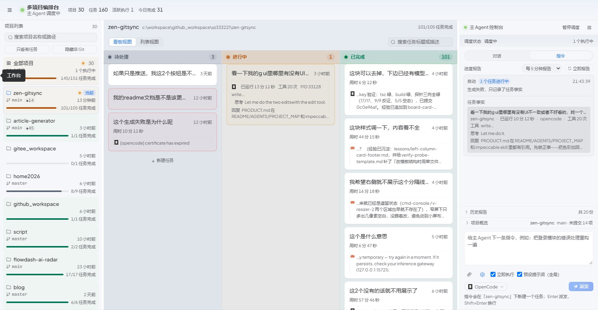
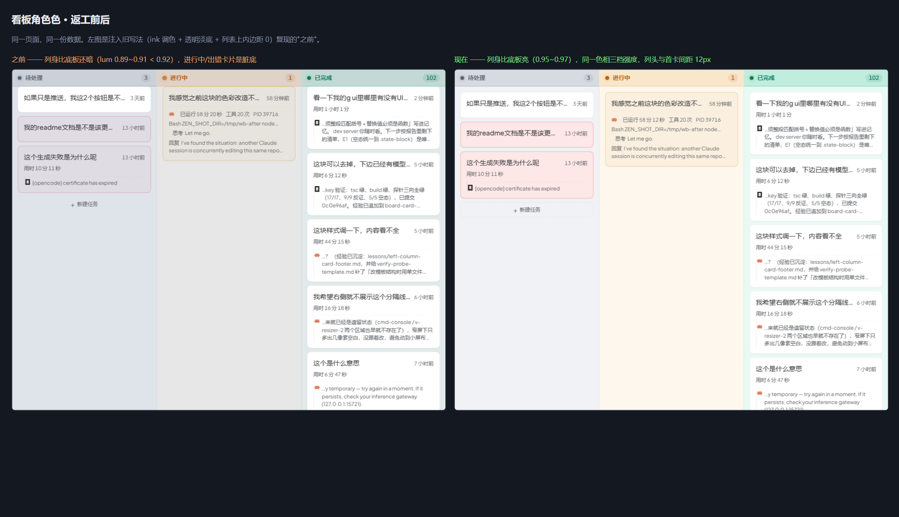
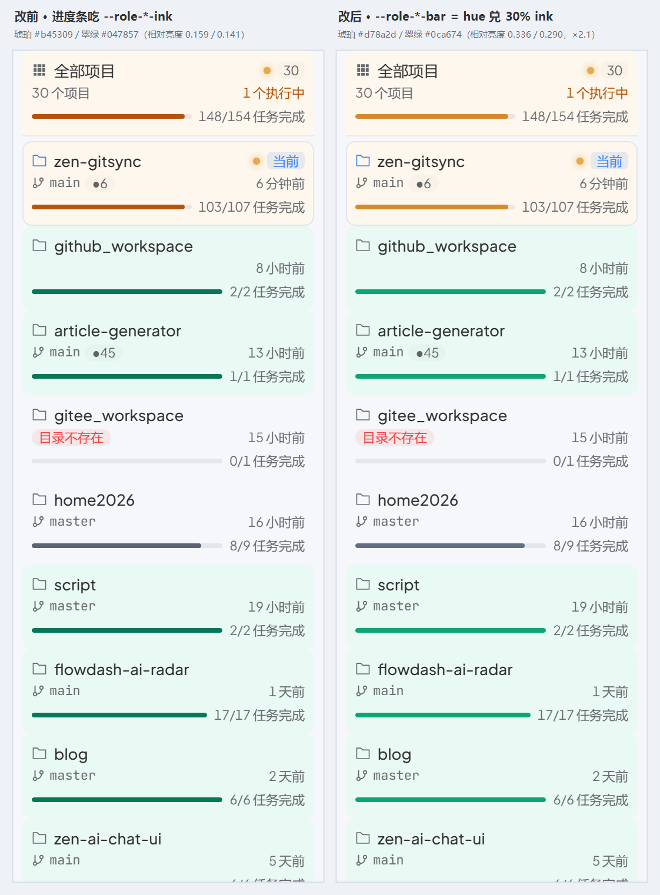
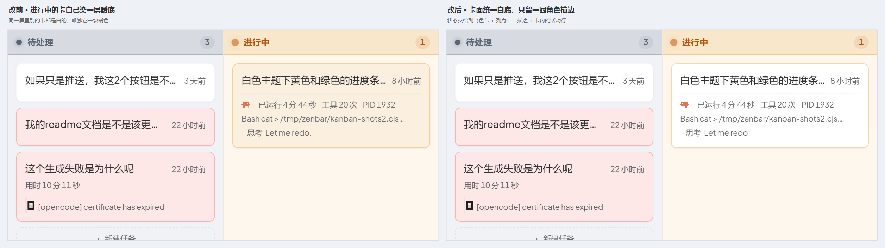
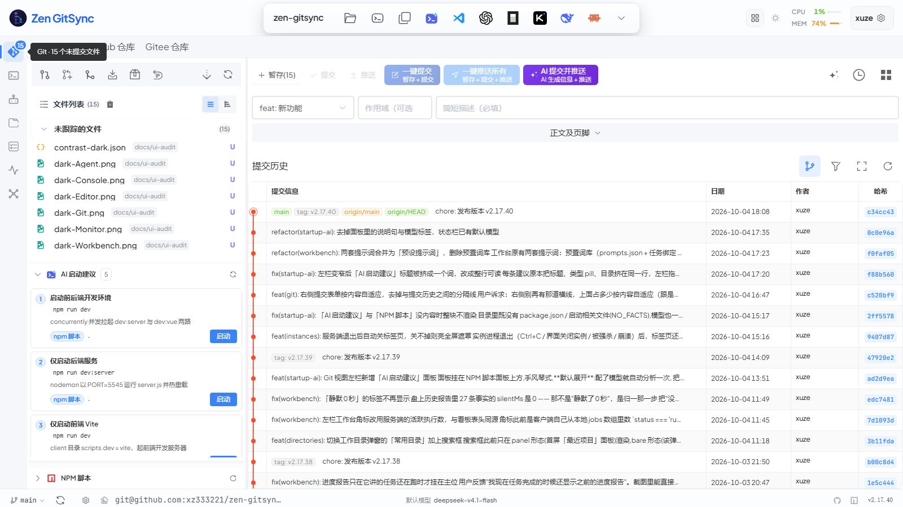
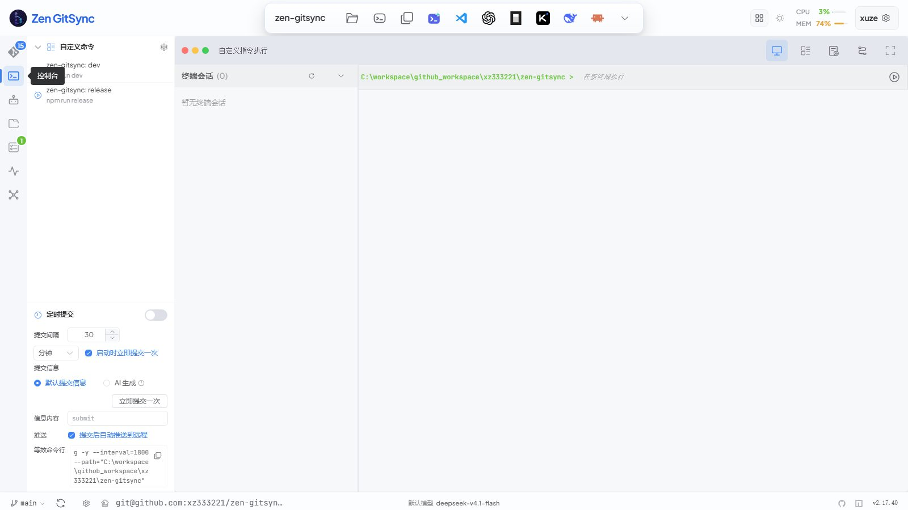

# UI 一致性审计（impeccable）

日期：2026-10-04 · 版本 v2.17.40 · 方法：`$impeccable critique`（LLM 盲评 + 确定性检测器 + 运行时几何探针）

## 第二轮：把色彩加回来（同日）

第一轮按 `PRODUCT.md` 的反参考清完之后，用户反馈「**没有丰富的色彩又有些单调**」。
诊断下来根因不是"色板不够"，是**角色太少**：全站只有"主色蓝 + 状态三色"，
一屏看下来所有东西都是同一个蓝，层级只能靠明度分 —— 而明度差在 1600px 宽下
基本看不出来。于是三颗并排的按钮（蓝渐变 / 浅蓝渐变 / 紫渐变）清成两档蓝之后，
用户看到的不是"更干净了"，是"三颗差不多的蓝"。

### 加了什么：语义角色色

`variables.scss` 新增一族 `--role-*`，把「这块东西是什么角色」直接编码成色相：

| 角色 | 色相 | 用在哪 |
|---|---|---|
| `pending` | 石板灰蓝 | 看板「待处理」列、闲置项目的进度条 |
| `active` | 琥珀 | 看板「进行中」列（+ 在跑项目的进度条） |
| `done` | 翠绿 | 看板「已完成」列 + 已完成项目的进度条 |
| `error` | 红 | 出错的卡片 |
| `ai` | 紫 | 「AI 提交并推送」按钮 |

每个角色七支：`hue`（纯色相，**只**用于调色）/ `ink`（文字/图标，浅底过 AA 4.5:1）/
`surface`（大面积氛围淡底）/ `wash`（承载状态那一块，与 surface 同色相、浓度更高；
第五轮起只剩"出错的卡片"一处消费，进行中的卡改成不染底色 —— 见下）/
`bar`（进度条这类**实心色块**的填充，比 ink 亮一档 —— 它不承载文字，不该吃文字的对比度预算）/
`edge`（1px 描边，半透明）/ `glow`（状态点微光）。**一个元素只挑一个角色**，
正文永远走 `--text-*`（角色色不是拿来染正文的）。
（`hue` / `wash` 是第三轮加的、`bar` 是第四轮加的，起因见下。）

### 三处具体改动

1. **看板三列第一次有了身份**。之前三列除了一个 6px 圆点之外全是同一个蓝 + 同一个
   灰底，并排时只能靠位置和文字认。现在列头铺 14% 的角色色带（标识）、列身铺 6%
   淡底（氛围）、标题与计数吃角色色 `ink` + 同色 10% 计数 chip。
   看板的核心心智模型就是"待处理 → 进行中 → 已完成"这条流水线，角色色是它最直接的
   视觉表达。
2. **项目进度条按角色上色**。原本是 `--gradient-progress`（蓝渐变），30 个项目排下来
   是一条条同一个蓝，完全没传递信息。现在：有活儿在跑 = 琥珀、已收尾 = 翠绿、
   闲置 = 石板灰。
3. **AI 按钮改回实心紫**（`--role-ai-ink`）。这里要更正第一轮的判断：
   **该禁的从来是渐变，不是色相**。紫色在本仓库本来就承担 `--color-think`（思考区）/
   `--color-info-light`（活动栏徽标）/ `--git-status-untrusted`（未跟踪文件）三处状态色
   身份，第一轮把它连同渐变一起降级成主色，属于误判。现在动作区是三档三角色：
   一档 `primary-dark` / 二档 `primary` / AI 档 `role-ai`，三档描边中性。

### 回归网跟着改了

`verify:ui-consistency` 里那条 `AiQuickPushButton 已改走主色家族` 的口径作废，
换成两条新的：① 按钮不许有渐变但必须是实心 `--role-ai-ink`；
② 五个角色 × 三档槽位在 `variables.scss` 里必须齐全，且 `dark-theme.scss`
必须覆盖 ink（忘了暗色下角色色会比正文还暗）。当前 **21/21 全绿**。



### 第三轮：看板角色色返工（同日）

第二轮上线后用户反馈：**「白色主题下感觉颜色偏深偏暗，进行中的卡片和失败的卡片
颜色不太好，卡片和上边的看板类型的 title 之间没有间距」**。
上一节写的"列身铺 6% 淡底、列头铺 14% 角色色带"就是问题本身，三条根因：

1. **淡底是从 `ink` 调出来的**（列头 `color-mix(--col-ink 14%, transparent)`）。
   `ink` 是为小字过 AA 4.5:1 刻意压暗的档（active = #b45309 深棕、done = #047857
   墨绿），拿它当调色源，兑出来是灰褐 / 灰绿，不是淡彩。
2. **合成基底是 `--surface-canvas`（#e7ebf2，92% 明度的灰）而不是 near-white**。
   6% 的透明淡底落在它上面，明度再掉一档。实测旧写法列身亮度 **0.89~0.91，
   比底板 0.92 还暗** —— 所谓"偏深偏暗"是可量化的，不是感觉。
3. 状态卡拿同一个 6% 透明淡底**当自己的背景**，等于把卡片的白底换掉，
   比旁边的白卡更暗更浑（进行中 0.890 / 出错 0.871）。
   外加 `.kb-col__list` 的上内边距是 0，首卡与列头贴死。

修法：加 `hue` 与 `wash` 两支槽位，淡底一律从 `hue` 兑进 `--surface-elevated`
（浅色因此是**不透明**的，暗色必须在 `dark-theme.scss` 整套覆盖 —— 漏了就是白板），
看板三档浓度 = 同一色相的 **9%（列身）/ 26%（列头色带）/ 16%（状态卡）**
（第三档**第五轮已撤**，见下），列表上内边距补 12px。



回归网：`verify:wb-colors`（12 条，第四轮补了 3 条），双向。
运行时读的是**合成后的真实底色**而不是"截图看着对"；`--reverse` 逐字注入旧写法
（不是稻草人），列身亮度 / 状态卡亮度 / 间距那 5 条必须变红。

### 第四轮：进度条填充改走 `bar`（2026-10-05）

第二轮把进度条从"蓝渐变"改成"按角色上色"时，颜色是直接吃 `ink` 的 ——
而 `ink` 是给**小字**过 AA 4.5:1 刻意压暗的档（琥珀 `#b45309` / 翠绿 `#047857`）。
于是用户又来一轮：**「白色主题下黄色和绿色的进度条还是感觉有点深」**。
这和第三轮是同一个错的另一个出口：**实心色块（不是文字）不该继承文字的对比度预算**。

修法：新增第七支槽位 `--role-*-bar`，浅色档 = `color-mix(hue 70%, ink)`，
三个消费点（项目列表 / 控制台进度报告 / 任务事实每条进度）改吃它。
亮度抬了一倍：琥珀 0.159 → 0.336（×2.1）、翠绿 0.141 → 0.290（×2.0）。
暗色档故意保留 `ink`（暗色的 ink 走亮档 `#34d399` / `#fbbf24`，本来就不发沉），
暗色下渲染结果与改前**逐位相同**。

**代价是写下来的，不是没注意**：与轨道的对比度从 4.1~4.4:1 降到 2.2~2.5:1。
近白轨道上"用户要的轻"和 WCAG 非文本 3:1 不可能同时成立 ——
3:1 要求填充相对亮度 ≤0.23，那正是 `#059669` 以下的深档（就是被嫌深的那一档）。
所以把上下限交给探针的两条断言：亮于同角色 ink ≥1.6×（不许再深）、
对轨道 ≥2.0:1（不许浅到糊在轨道里）。两侧边界都实测过：
旧写法（整条吃 ink）比值恒 1.0，`--reverse` 里 C6a 变红；
把填充换成**纯 hue** 则 active 掉到 1.77:1、done 2.02:1，C6b 会红（条会糊进轨道）。



（`pending` 那一档几乎没动：它的 hue `#64748b` 与 ink `#5b6472` 本来就同族，
而它答的是"这个项目没在跑"，静默正是它的语义 —— 所以 C6a 对它的下限只卡 1.05×。）

### 第五轮：进行中的卡不再自己染底色（2026-10-05）

用户：**「我非进行中的正常任务都是白色，进行中的是橙色有点奇怪」**。
第三轮的判断是"卡片是信号、列身是氛围，所以卡片浓度要比列身高"，
但漏了一层：**卡片落在哪一列，是它自己的状态推出来的**（`is-running` ⇔ 进 进行中 列），
卡面再染一遍色属于**纯冗余**；代价却是同一屏里别的卡都白、唯独它一块暖色，
读起来像"另一种卡"，而不是"同一个卡在跑"。

修法：`.kb-card.is-running` 只留 `--role-active-edge` 描边，底色回到与其他卡一致的
`--surface-elevated`。状态改由三处共同表达：列（色带 + 列身氛围）、这圈角色描边、
卡片自己的活动行（「已运行 x 秒 · 工具 n 次 · PID …」）。
顺带把"卡片比列身更抢眼"的老问题也解掉了 —— 同列所有卡同底，扫视时没有块状跳变。

**错误卡（`.has-error`）故意不跟着改**，keep 淡红底：出错是**跨列**的状态，
待处理 / 已完成 列里都会混着白卡，不染就扫不出哪条失败了；
而"在跑"是**被列蕴含**的状态，两者不是一回事。



回归网：`verify:wb-colors` 的 C3c 换了口径 ——
旧断言"进行中的卡是浅暖底（lum ≥ 0.90 且 r > b）"改成
**"与同列的普通卡同底"**（比较两块的合成色是否逐位相同，而不是硬写 `#fff`：
要守的契约是**一致**，不是某个具体底色）。`--reverse` 里它照旧变红
（旧写法注进去 = 卡面又被染成 `rgb(231, 227, 221)`）。
背景色棘轮这一屏观测上限从 36 落到 35，红线留在 36 当余量。


## 修复状态（2026-10-04 当轮）

| # | 结论 | 状态 | 落地 |
|---|---|---|---|
| **P0-01** | 状态色当正文用，2.05–2.90:1 | ✅ 已修 | 121 处 `color:` 换 `--color-*-dark`；暗色由 `dark-theme.scss` 自动重映射。实测见 `contrast-after.json` |
| **P0-02** | `border-left: 2/3/4px` 侧边色条 21 处 | 🟡 19/21 | 有语义的→淡底+1px 描边；只当缩进的→删掉。剩 2 处有探针逐字断言，见下方「故意没动」 |
| **P0-03** | 全屏 loading 蓝绿彩虹渐变 + 25px 磨砂 | ✅ 已修 | 12 处改单色令牌，顺带删掉整段失效的 `[data-theme="dark"]` 覆盖 |
| **P0-04** | AI 按钮紫罗兰**渐变** | 🔁 第一轮改成主色、第二轮改回实心紫 | 渐变确实该删，但色相不该删 —— 见上面「第二轮」 |
| **P0-05** | `--radius-sm` / `--shadow-xs` 拼错 | ✅ 已修 | 另发现 `scripts/convert-to-standard-vars.cjs` 一直在静默产出坏 CSS，一并修 |
| **P1-09** | `--z-*` 8 个令牌 0 消费，31 处硬编码 | ✅ 已修 | 补 9 档，25 处替换；数值与原硬编码**逐一相等**，不重排层级 |
| **P1-10** | `input { box-shadow: none !important }` 废掉焦点环 | ✅ 已修 | 改 `input:not(:focus)` |
| **P1-11** | 焦点环 7 种写法、IconButton 双层环 | ✅ 已修 | 45 处统一 `--focus-outline` |
| **P1-14** | `workbench.scss` 498 行只有 3 处消费者 | ✅ 已修 | 506 → 284 行，删 5 族 0 消费者工具类 + 8 个孤儿令牌 |
| **P2-15** | 暗色下 `--text-meta-dark` 与 tertiary 塌陷成同值 | ✅ 已修 | tertiary-dark 调暗到 `#b4bac2` 让位；183 处 `color:` 从 tertiary 换 meta |
| **P2-19** | `toggleTheme()` 永久丢掉 auto 档 | ❌ **原报告判断有误** | `GitGlobalSettingsDialog` 的主题下拉本来就有「跟随系统」三档，auto 没丢。这条撤回 |
| **E6** | 禁用透明度 6 档 + 两个 `!important` 打架 | ✅ 已修 | 新增 `--disabled-opacity: 0.5`，36 处归一 |
| **E8** | `IconButton` 残留 EP 旧默认蓝 | ✅ 已修 | 另清掉全仓 17 处 `rgba(64,158,255,*)` |
| **D1** | 图标按钮 12 种尺寸 | 🟡 部分 | `--medium` 的 19px 字形不在刻度上 → 走新令牌 20px。**28/38/44 三档本身未动**（67 个使用点，需实跑验证） |
| **D4** | 刷新按钮 10 种外观 × 5 种加载态 | ⬜ 未做 | 需抽 `RefreshButton` 组件，改动面大 |
| **D5** | 弹窗按钮三套家族 + body padding 四套 | ⬜ 未做 | 42 个 `<CommonDialog>` 逐个过 |
| **E1** | 空态 28 个类名、骨架屏 0 使用 | ⬜ 未做 | 工作量最大的一条 |
| **E2** | 主界面字号天花板 14px（h1=h2=14px） | ⬜ 未做 | 需先定信息层级方案 |
| **E3** | 17 处失效的 `prefers-reduced-motion` | ⬜ 未做 | 纯删除，低风险但零视觉收益 |
| **E5** | 控制台左栏两个功能区无分界、控件不对齐 | ⬜ 未做 | 需重排 `ConsoleView` 左栏 |
| **E7** | 圆角离刻度 + `.card`/`.app-card` radius 0 | ⬜ 未做 | |
| **A5** | 间距刻度缺 3/6/7/10 | ⬜ 未做 | 见下方修正：真实分布是 16 种 |

回归网：`npm run verify:ui-consistency`（新增）。16 条静态断言把上面这些口径钉住，
外加 3 条运行时棘轮（同屏值种类不许再涨）。当前 **19/19 全绿**。

### 故意没动的 2 处

| 位置 | 为什么 |
|---|---|
| `WorkbenchKanban.vue` `.kb-card__reply` 的 2px 竖线 | `verify-wb-card-reply.cjs:302` 逐字断言 `borderLeft === '2px'`；同一元素还被 `verify-wb-card-executor-icon.cjs`（断言图标 left 落在 replyLeft 与正文 left 之间）和 `verify-wb-card-fade-band.cjs`（按 `paddingLeft` 算渐隐带）依赖。要改必须连探针一起改**并实跑** |
| `TreeNodeItem.vue` 文件树选中态的 3px 竖条 | `tree-node` 在 `scripts/` 里有 19 处探针引用，选中态几何不能盲改 |

### 对本报告的修正

- **背景色不是 16 种，是 33 种。** 原文只统计了 top-18 切片。真实分布见
  `contrast-after.json` 同批实测：尾部全是 Element Plus v2 默认色
  （`rgb(255,95,87)` / `rgb(255,189,46)` / `rgb(40,200,64)` / `rgb(103,194,58)`）
  在漏 —— **这是一条原文没发现的独立问题：EP v2 的调色板在漏进来**。
- **P2-19（主题 auto 档）判断有误，已撤回。** 设置弹窗本来就有三档下拉。
- 间距种类实测 **16 种**（原文写 13）。

## 怎么做的

| 通道 | 手段 | 覆盖 |
|---|---|---|
| A · LLM 盲评 | 独立子代理，只读 `PRODUCT.md` + 全部样式表 + 22 个视图/组件，不看其它通道输出 | 静态全量 |
| B · 确定性检测器 | `npx impeccable --json src/ui/client/src` | 54 findings，全 warning |
| C · 运行时几何探针 | Playwright 在真实页面遍历 computed style，统计**同一屏内**实际渲染出的值 | Git 视图满载态 |
| D · 肉眼读图 | 8 张截图（4 视图 × 明暗） | 见下 |

设计基准：`PRODUCT.md`（register = product）。反参考里明令禁止的三条 —— 彩虹渐变 / AI 紫、默认暗色、重阴影玻璃拟态 —— 本次全部命中。

**Nielsen 10 启发式总分 24 / 40**（中位）。**认知负荷 8 条清单失败 5 条 → 偏高。**

一句话：**不是缺设计系统，是系统没被用。** 令牌纪律在字体线上执行得很干净（21 处裸 `font-size`，只 2 处越界），但在间距、圆角、z-index、焦点环、按钮尺寸上全面失守。



## 运行时实测：同一屏内的值种类

只统计 Git 视图这一屏（不算弹窗），数字来自 `geometry.json`：

| 维度 | 同屏实测种类 | 备注 |
|---|---|---|
| 图标按钮尺寸 | **12 种** | 11×11 / 14×14 / 16×16 / 16×28 / 22×22 / 28×28 / 29×17 / 32×32 / 36×36 / 38×38 / 44×44 / 58×19 |
| 间距（padding/margin/gap） | **16 种** | 3px 用了 206 次、7px 90 次、5px 12 次 —— 全都不在刻度上 |
| 背景色 | **33 种**（排除透明底） | `#f5f7fa` / `#f4f4f5` / `#f3f4f6` / `#f7f8fa` 四个灰差 ≤2/255（肉眼不可辨）却是四个来源；尾部还有 EP v2 默认色在漏 |
| 圆角 | 14 种 | 含 5px、10px、非对称 `0px 6px 0px 0px` |
| 字号 | 8 档 | 22px 只出现 3 次（孤儿值）；13px 夹在 12 与 14 之间 |

「3px 是最高频间距」这件事在代码层直接决定了下面 P1-07 那条：两个令牌刻度并存，没人承认。

## P0 —— 违反 `PRODUCT.md` 明文禁令或 AA 硬失败

### P0-01 状态色当正文用，全站对比度 2.05–2.90:1

`variables.scss:20,26,29,33` 定义，`:425-428` 做别名。实测（`--bg-panel: #f5f7fa`，已核实）：**119 处** `color: var(--color-success|warning|danger|info)` 直接消费，而文字专用的 `--color-*-dark` 只被用了 **5 处**。

| 令牌 | 值 | 在 `--bg-panel` 上 |
|---|---|---|
| `--color-success` | `#67c23a` | **2.24:1** |
| `--color-warning` | `#e6a23c` | **2.05:1** |
| `--color-danger` | `#f56c6c` | **2.90:1** |
| `--color-info` | `#909399` | **3.08:1** |

AA 要求 4.5:1。消费点散布在 `OrchestratorConsole.vue:1262,1617,1780,1836`、`WorkbenchKanban.vue:1062,1383`、`CommandConsole.vue:3200,3214,3285,3366,3802,3823`、`PushProgressModal.vue:366,372,635`、`MarketplacePanel.vue:655,760,896` 等。

**讽刺点**：`GitActionButtons.vue:232-233` 的注释已经写明「主色正文在浅底上只有 ~3.3:1，切色会掉到 AA 以下」—— 这条认知只被用在了 1 个地方。而 `variables.scss:22,28,32` 的 `--color-*-dark`（`#047857` / `#b45309` / `#b91c1c`，白底 5.4:1 以上）已经存在，只是没被文字消费。

**修**：文字一律走 `--color-*-dark`（暗色主题下 `dark-theme.scss:200-203` 已经切好了），填充/描边继续用亮色。改造后 `--color-*-dark` 的消费点会从 5 处变成 119 处 —— 这也顺带给「哪个色是给字用的」建立了唯一判据。

**用户感受**：最需要被读到的信息（落后远程、执行失败、有 N 个未提交）用的是最难读的颜色。125% 缩放基本读不出警告文案。

---

### P0-02 `border-left: 2/3/4px` 侧边色条，21 处，宽度三档

这是 impeccable 的绝对禁止项（`Side-stripe borders`），检测器也独立报了 23 处 `side-tab`。实测 21 处 `border-left > 1px`：

```
TagListButton.vue:633(3px)      AiDiffSummary.vue:329(3px)      CommandConsole.vue:3747/3751/3755(3px)
ExecutionLogManager.vue:602(2px) FileDiffViewer.vue:2493(4px)     GitGlobalSettingsDialog.vue:1870(2px)
TemplateManager.vue:506(4px)     TreeNodeItem.vue:194(3px)        UpgradeDialog.vue:204/227(3px)
markdown-renderer.css:83(3px)    CommandHistory.vue:975/1070/1076(3px)
OrchestratorConsole.vue:1471/1547(2px)   WorkbenchKanban.vue:1086/1109/1373(2px)
WorkbenchView.vue:2368(2px)
```

`ActivityBar.vue:383-396` 和 `WorkbenchSidebar.vue:416-420` 还用伪元素画了 3px 竖条，后者额外带 `linear-gradient` + `0 0 8px` 发光 —— 在 200px 宽的侧栏里像一根发光的钉子。`ActivityBar.vue:381` 的注释先写「PRODUCT.md 明确无装饰效果」，下一行就是那条竖条。

**项目自己已经做对过**：`WorkbenchKanban.vue:846-860` 的 `is-running` / `has-error` / `is-opened` 全用 `border-color` 变化 + 底色 tint，没有一根条。截图里待处理列那 3 张卡（1 灰 2 粉）就是这么实现的，效果干净。

**修**：全部换成「底色 tint + 1px border-color 变化」。

---

### P0-03 全屏 loading 是蓝→绿彩虹渐变 + 25px 磨砂

`GlobalLoading.vue:88-90`：

```
linear-gradient(135deg, rgba(64,158,255,.9) 0%, rgba(103,194,58,.9) 100%)
backdrop-filter: blur(25px)
box-shadow: 0 8px 32px rgba(0,0,0,.3)
```

三个问题叠在一起：

1. `PRODUCT.md:34` 第一条禁令（彩虹渐变）
2. `rgba(64,158,255)` 是 Element Plus 旧默认蓝 —— `variables.scss:394-397` 明确记录「不再保留 EP 默认的 #409eff（历史上两套蓝同屏可见色差）」，这里是残留
3. `:153` 进度条是 `linear-gradient(90deg, var(--bg-container), rgba(255,255,255,.8))` —— **浅色主题下是白渐变压在蓝绿底上，几乎不可见**

另外 `:68` 浅色遮罩 `rgba(255,255,255,0)` 全透明，`:229` 暗色 `rgba(0,0,0,.45)`，`:233` 暗色底又变成纯灰 —— 同一个组件两套主题是两个不同的物体。

---

### P0-04 AI 按钮紫罗兰渐变（`PRODUCT.md` 明文禁止 "AI purple"）

`AiQuickPushButton.vue:171-183`，`linear-gradient(135deg, #7c3aed, #6d28d9)` + `!important`，配套 `GitActionButtons.vue:218-220` 注释写「用紫不用蓝是刻意的」。

`AiQuickPushButton.vue:167-170` 的注释给的理由是「紫色在本仓库已经是 AI 的语言」—— 这个论证成立，但结论反了：`PRODUCT.md` 恰好把 AI 紫列为品牌禁区。紫色现在有**四重身份**：`--color-think #8b5cf6`（思考区）、`--color-info-light #8b5cf6`（活动栏徽标）、`--git-status-untracked #8b5cf6`（未跟踪文件）、以及这四个硬编码渐变值。

截图里 Git 视图顶部三个动作按钮是**蓝渐变 / 浅蓝渐变 / 紫渐变**三色并列 —— 而「提交」和「推送」本身的语义差别，比「是不是 AI 写的」小得多。

---

### P0-05 两个令牌名拼错，CSS 静默降级

| 引用 | 实际令牌表 | 后果 |
|---|---|---|
| `WorkbenchKanban.vue:909` `var(--radius-sm)` | `--radius-{xs,base,md,lg,xl,full,pill}`，**无 sm** | fallback 落初始值 `0` → `.kb-card__auto-done`（AI 判定完成胶囊）**渲染成直角**，而同屏 `.kb-card__project-chip`（`:971`）是 `--radius-pill` 全圆 |
| `OrchestratorConsole.vue:1296` `var(--shadow-xs, ...)` | `--shadow-{sm,base,md,lg,xl,hover,active,focus,dark,dark-lg,card-rest,card-lift}`，**无 xs** | 有 fallback，阴影弱一档，不算坏 |

`node --check` 是绿的，也没有 lint 报这两个 —— 编译器不报错，视觉上「看得出不对但说不出哪不对」。

## P1 —— 用户能直接感知的不一致

### P1-06 图标按钮 12 种尺寸（实测）

```
workbench.scss:108-122   sm 20px/12px字 · md 22px/13px字 · lg 24px/12px字  ← lg 的字号比 md 还小
common.scss:548-551      .btn-icon-24 / 28 / 32 / 36                    ← 28 无令牌
IconButton.vue:142-206   28px/14px字 · 38px/19px字 · 44px/24px字        ← 19 不在任何刻度
WorkbenchBoard.vue:968   26px/14px字
variables.scss:621-623   --control-height-sm/md/lg = 24/32/36
```

`IconButton` 被 **67 处**使用（跨 27 个文件），是全场最广的按钮组件，却用 28/38/44 这套完全在 `--control-height-*` 之外的尺寸。`workbench.scss:118-122` 那条是明确的 bug（`--lg` 字号小于 `--md`）。

**用户感受**：鼠标横着扫一遍，点击区大小肉眼可见地跳。

---

### P1-07 间距刻度有两个并存的三套值

`variables.scss:442-449` 定义 `2/4/8/12/16/24/32/48`。之外的高频值：

| 值 | 次数 | 典型位置 |
|---|---|---|
| **6px** | 225 | `WorkbenchKanban.vue:873`、`.activity-bar{padding:10px 0;gap:6px}` (`ActivityBar.vue:334-335`) |
| **3px** | 206（实测最高频） | `.kb__views{padding:3px}` (`WorkbenchKanban.vue:687`) |
| **10px** | 126 | `.kb__filters{gap:10px}` (`:713`) |
| **7px** | 48（实测） | `.el-button--small{padding:7px 12px}` (`unified-dialogs.scss:155-157`) |
| 14px | 47 | `.wb-empty{padding:24px 14px 20px}` (`WorkbenchSidebar.vue:512`) |

`7px` 尤其值得单说：`7px 上下 padding + 12px 字 ≈ 31px 高`，而 `--control-height-sm` 是 **24px** —— 同一个「小」号按钮在两处差 7px。

---

### P1-08 背景色 16 种同屏，四个灰差 ≤2/255

实测值：`#fff` / `#fafafa` / `#f5f7fa` / `#f4f4f5` / `#f3f4f6` / `#f7f8fa` / `#f0f2f5` / `#ecf5ff` / `#f0f9eb` / `rgba(255,255,255,.82)` / `rgba(0,0,0,.03)` / `rgba(0,0,0,.02)` …

`#f5f7fa` vs `#f4f4f5` vs `#f3f4f6` 三个灰**肉眼完全不可辨**，却是三个来源。用户看到的是「有些面板白、有些面板灰」，但说不出为什么。

`--surface-canvas`（`variables.scss` → `#e7ebf2`，暗色 `#0f131b`）是三栏纵深的唯一开关，这一处做得对。

---

### P1-09 `--z-*` 9 个令牌，0 次消费；31 个硬编码层级

```
--z-dropdown 1000 / --z-sticky 1020 / --z-fixed 1030 / --z-modal-backdrop 1040
--z-modal 1050 / --z-popover 1060 / --z-tooltip 1070 / --z-toast 1080
→ var(--z-*) 全仓使用次数：每个都是 0
```

实际分布（`z-index:` 出现次数）：

```
1×18  2×7  5×4  10×8  20×2  9999×11  999999×1(LogList.vue:2257)
3000000/3000001/3000002/3000003/3000010 ×5(CustomCommandManager.vue:1162-1178)
3100000×1  3100001×2(CustomCommandManager.vue:1199-1208)
```

`999999`（注释写「最大 z-index 保证全局提示框最上层」）和 `3100001` 谁在上面，已经无法从代码判断。

---

### P1-10 `input { box-shadow: none !important }` 静默废掉输入焦点环

`common.scss` **最后 3 行**，无任何注释：

```css
input {
  box-shadow: none!important;
}
```

这条覆盖了所有原生 `<input>` 的 `box-shadow`，因此 `workbench.scss:268` 的 `--input-shadow-focus`（`--focus-ring` + inset）对任何走 `.wb-input-base` 的输入框都失效。而 `unified-dialogs.scss:435` 给 el-input 单独补了 `2px tint-22` 的环 —— 于是**原生 input 和 el-input 的焦点环宽度与透明度都不同**。

---

### P1-11 焦点环 7 种写法，`IconButton` 画了双层环

| 位置 | 写法 |
|---|---|
| `variables.scss:636-641` | `--focus-ring` 3px@18% / `-soft` 3px@12% / `-strong` 4px@30% / `--focus-outline` 2px solid + offset 1/2px |
| `variables.scss:329` | `--dialog-focus-ring` 3px@16% |
| `unified-dialogs.scss:428 / :435` | `0 0 0 1px` / `0 0 0 2px tint-22` |
| `workbench.scss:265-269` | `--input-shadow-focus` = `--focus-ring` + inset |
| `IconButton.vue:135-139` / `ActivityBar.vue:371` / `GitActionButtons.vue:178` | 各自 color-mix |

**最严重的一处** `IconButton.vue:135-139`：

```css
&:focus-visible {
  box-shadow: 0 0 0 2px var(--tint-primary-30);
  outline: 2px solid var(--color-primary);
  outline-offset: 2px;
}
```

双层焦点环。而 `common.scss:1214-1219` 有一段注释明确说全局焦点环被删掉，就是因为它「跟 zen-ai-chat-ui 叠在一起会出现双层 3px 同心蓝圈（大框套小框）」—— `IconButton` 把刚被删掉的东西又写了回来，而它有 67 个使用点。

---

### P1-12 「刷新」这一个动作，10 种外观 × 5 种加载态

`el-button :loading`（`ExecutionLogManager.vue:17`、`MemoryPanel.vue:26`）/ `el-button text`（`AiDiffSummary.vue:290`）/ `.refresh-btn` tab（`TagListButton.vue:270`、`PackageJsonSelector.vue:324`）/ `.mp-refresh.spinning`（`MarketplacePanel.vue:309`）/ `.dir-list__refresh.is-spinning`（`DirListRefreshButton.vue:68`）/ `.dir-summary__refresh.is-spinning`（`RecentDirectoriesSummary.vue:376`）/ 内联 `<el-icon class="is-loading">`（`BranchSelector.vue:172`、`RemoteReposList.vue:877,990`、`ToolInstallDialog.vue:165`）/ `.form-label__refresh`（`DirectorySelector.vue:1147`）/ `.banner-btn-icon`（`AppErrorBanner.vue:109`）…

全仓 **47 个** spin/rotate/pulse `@keyframes`，`rotating` 一个名字被 **7 个文件**各自定义。

---

### P1-13 弹窗按钮三套家族 + body padding 四套

```
common.scss:644-659      .dialog-cancel-btn   min-width 80px + height 36px
common.scss:672-691      .dialog-confirm-btn  min-width 80px + height 36px（背景是 primary→primary-dark 渐变）
CommonDialog.vue:279-282 .common-dialog__footer .el-button  min-width 88px，不设高度
unified-dialogs.scss:155-157 .el-button--small { padding: 7px 12px }
```

42 个 `<CommonDialog>` 用 88px + EP padding，`dialog-cancel-btn` 系列用 80px + 36px —— **相邻两个弹窗的「取消」按钮宽度差 8px，高度手感也不一样**。

body padding 同样四套：`unified-dialogs.scss:124`（8/12/10）、`common.scss:325`（8/16）、`CommonDialog.vue:304`（12 四边）、`CommonDialog.vue:352`（8/12/12）。

---

### P1-14 `workbench.scss` 498 行，实际只有 3 处消费者（**根因**）

文件头 `:4-11` 写着「把重复出现的胶囊徽标 / 透明图标按钮 / 主色软按钮 / focus ring / 列表卡片 / input 基线集中沉淀为语义工具类，降低后续维护的重复度」。实测被 `class=` 引用的次数：

```
wb-pill        1
wb-soft-btn    2
wb-attachments 1
wb-icon-btn    0
wb-card        0
wb-input-base  0
wb-focus-ring  0
```

而 `WorkbenchSidebar.vue:530` 还用 scoped 样式把 `.wb-pill` 重定义成 `border-radius: var(--radius-lg)`（8px，不是全局的 999px）并删掉了 border / letter-spacing / line-height / white-space —— **同一个类名在侧栏里是方角、在别处是全圆**。

上面 13 条不一致的共同根因不是没人想统一，是**统一层从没被采用，而每个组件都以为自己那版是对的**。这个决定必须先做，因为它决定后面是逐条修还是一次性重置。

## P2 —— 明显但可容忍

### P2-15 暗色主题下 `--text-meta` 与 `--text-tertiary` 完全塌陷成同一个值

```
variables.scss:371  --text-tertiary:     #909399
variables.scss:372  --text-tertiary-dark: #cbd0d6
variables.scss:381  --text-meta:         #686a6f      ← 浅色下 5.01:1，设计得很扎实
variables.scss:382  --text-meta-dark:    #cbd0d6      ← 与 tertiary-dark 完全相同
```

实测（`contrast-dark.json`）：暗色下 `--text-meta` 和 `--text-tertiary` 都解析成 `#cbd0d6`。

`--text-meta` 这个令牌发明得很专业 —— `variables.scss:374-381` 先实测出 `#909399` 在面板上只有 2.87:1，再反解出 `#686a6f` 并给出三个底色的实测值。但暗色下两者相同，**这套「meta 档」的语义在暗色里不存在**。

顺带：浅色下 `color: var(--text-tertiary)` 仍有 **192 处**（对比 `color: var(--text-meta)` 的 71 处，覆盖率 ~27%）。`ActivityBar.vue:351` 整个左侧导航栏图标就是 tertiary —— 使用频次最高、面积最小、对比度最差的一处。

---

### P2-16 空态 28 个类名，设计好的骨架屏 0 使用

```
common.scss:925-1058   .state-block（--empty/--error/--warning/--success/--loading 五态，130 行）→ 只被 App.vue 用了 4 次
common.scss:1063-1111  .skeleton（--text/--title/--block/--circle + shimmer，50 行）→ 全仓 0 次使用
<el-empty>                                                          → 17 次 / 8 个文件
手写类名 24 个：proj-empty / wb-empty--rich / oc-empty / log-empty-state / empty-status /
             tree-empty / editor-empty / mm-sidebar-empty / sm-tree-empty / mp-empty /
             rm-empty / startup-empty / branch-empty / disks-empty / ports-empty /
             empty-scripts / model-empty / instance-empty / condition-empty …
```

图标尺寸三档（36 / 56 / 64px）、内边距三档（`60px 20px` / `40px 24px` / `32px 24px`），`MemoryPanel.vue:439-442` 还额外加了 `1px dashed` 边框而另两个没有。

**用户感受**：每个界面的「这里什么都没有」长得都不一样。产品最该统一的那一屏反而最不统一。

---

### P2-17 主界面字号天花板 14px，h1 = h2 = 14px

```
WorkbenchBoard.vue:931-932     <h1> = --font-size-base (14px) / 600
WorkbenchBoard.vue:1062-1063   <h2> = 14px / 500
WorkbenchKanban.vue:783-784    <h3> = --font-size-sm (12px) / 500
OrchestratorConsole.vue:1211   <h3> = 12px / --text-secondary
```

`--font-size-xl`(20px) 全仓 12 处、**主工作台 0 处**；`--font-size-2xl`(24px) 6 处，全是空态图标和 `.el-message-box__status`。**排版刻度的顶端全部被空态装饰和图标占用，真实内容的天花板是 14px。**

而且 12px 同时出现在「面板标题」（`.oc__title`）和「列标题」（`.kb-col__title`）两个语义层级上。

---

### P2-18 47 个 spin 关键帧 / 55 处无限动画，17 处 `prefers-reduced-motion` 是死代码

`common.scss:11-20` 已用 `!important` 全局接管（`animation-duration: 0.01ms !important`），所以这 17 处局部块（`ActivityBar.vue:612`、`WorkbenchView.vue:1965,2095,2101,2616,2638,2818`、`App.vue:1830-1837` 等）全部无效。`App.vue:1830` 甚至以为自己有用（写了不带 `!important` 的 `animation-duration: 3s`）。

同时 `PRODUCT.md:37` 禁重装饰，而 `.el-overlay`（**每个弹窗的遮罩**）都挂 `backdrop-filter: blur(10px)`（`unified-dialogs.scss:20`）。

---

### P2-19 `toggleTheme()` 会永久丢掉「跟随系统」

`configStore.ts`：

```ts
function toggleTheme() {
  const currentlyDark = html.getAttribute('data-theme') === 'dark'
  const next: 'light' | 'dark' = currentlyDark ? 'light' : 'dark'   // ← 只产出这两档
  theme.value = next
  applyTheme(next)
  saveGeneralSettings({ theme: next })   // ← 持久化，覆盖掉原来的 'auto'
}
```

`applyTheme` 支持 `'auto'`（读 `prefers-color-scheme`），但用户点一次顶栏的太阳/月亮图标，写进 config 的就是 `'light'` 或 `'dark'`，**再也回不到 auto**。这与 `PRODUCT.md:36,51`「No aggressive dark mode default — respect system preference」「Support system dark/light mode preference」冲突。

## P3 —— 局部瑕疵

### P3-20 控制台视图左栏：两个功能区没有任何分界



- 上半「自定义命令」列表（白）与下半「定时提交」表单（`#f5f7fa`）**直接贴在一起**，y≈535 处只有一条硬边，没有 divider、没有间距、没有标题层级
- 一个「提交间隔 = 30 分钟」被拆成**两行两个控件**：上面 `el-input-number`（`30`，带 spinner），下面一个独立的「分钟」`el-select`，宽度还不一样
- 「立即提交一次」按钮相对上方控件**缩进约 38px**，左边界不对齐
- 「提交后自动推送到远程」复选框下面有一道多余的 border 痕迹
- 三个相邻 pane 的头部工具栏**各不相同**：左栏只有齿轮、中栏是刷新+折叠箭头、右栏 5 个图标
- 顶栏左上是 **macOS 红黄绿三点**（`● ● ●`）—— Windows 桌面应用上的 macOS 拟物装饰，且违反 `PRODUCT.md:34` 的「no rainbow」
- 「等效命令」的 monospace 块在面板底部被裁切

### P3-21 禁用态透明度 6 档，两个 `!important` 打架

`IconButton.vue:245`（0.4）/ `GitActionButtons.vue:183`（**`opacity:.4 !important`**）/ `workbench.scss:180,504`（0.5、0.4）/ `OrchestratorConsole.vue:1228,1370`（0.5）/ `unified-dialogs.scss:234`（**`opacity:.55 !important`**）/ `common.scss:525,704`（0.6）/ 若干（0.45、0.65）

`GitActionButtons.vue:183` 和 `unified-dialogs.scss:234` 打同一类按钮，**谁赢取决于 CSS 加载顺序**。

### P3-22 圆角离刻度 + `.card` 圆角为 0

- 离刻度：`CommandConsole.vue:3978` `5px`、`InstanceSwitcher.vue:392` `5px`、`SourceMapView.vue:1066` `5px`、`AppVersionBadge.vue:339` `11px`、`workbench.scss:357,386` `11px`（非对称硬写）
- `common.scss:402-408` `.app-card { border-radius: 0; box-shadow: none }`、`:415-429` `.card { border-radius: 0 }`，而 `CommitForm.vue:676` 的同一个 div 同时挂了 `.card` + `.app-card` + 两套 header/content 类 —— `.card .card-header{padding:var(--spacing-base)}` 与 `.app-card-header{padding:var(--spacing-base) var(--spacing-lg)}` 冲突，`.card:hover{shadow-lg}` 与 `.app-card:hover{shadow-md}` 也冲突
- `ProjectStartupAiPanel.vue:351-355` 是 `border-radius: 0` + `box-shadow: var(--shadow-md)` —— **直角 + 阴影**，视觉上像渲染错误

### P3-23 `IconButton.vue:237` 残留 EP 旧默认蓝

```css
background: rgba(64, 158, 255, 0.18);   /* .is-active:hover */
```

`variables.scss:394-397` 明确记录「单一主色来源…不再保留 EP 默认的 #409eff」。这是残留（另见 `GlobalLoading.vue:88`、`CommandConsole.vue:3747`）。

## 做得好的 3 点

**① 字号刻度是全仓最干净的一条线，而且是被刻意维护的。**
全仓只有 21 处裸 `font-size: NNpx`，其中 11 处落在 11/12/13/14/16/20/24 的 7 档上，真正的越界只有 2 处（`ActivityBar.vue:522` 的 10px、`ProjectStartupAiPanel.vue:463` 的 22px），其余 9 处是空态图标尺寸而非正文。`variables.scss:451-453` 还留了收敛记录（「原 10/18/22 与扩展档 11.5/12.5/13.5/15/17 全部并入最近档」）。

**② `--text-meta` 的推导方法本身是正确做法。**
`variables.scss:374-381` 把 WCAG 数值写进令牌注释当契约用：先实测 `#909399` 在面板上只有 2.87:1、画布上 2.75:1，再反解出 `#686a6f` 并给出三个底色的实测值（4.50 / 5.01 / 5.38），最后说明为什么不再暗一档（「再暗就与 secondary 撞车了」）。**方法论是对的，问题只在执行面覆盖了约 1/4，且暗色下塌陷成同一个值（P2-15）。**

**③ 头部注释承担了真正的设计决策记录。**
`WorkbenchKanban.vue:807-825` 用 19 行解释了 hover 遮罩为什么必须挂在卡片最后一行、多行块为什么只能 `add` 不能 `intersect`（「交集写出来等同单层且断言全绿 → 必须数像素」）。`common.scss:31-41` 解释了为什么不能在 Chromium 规则里写 `scrollbar-width: thin`。`ActivityBar.vue:432-434` 记录了删掉一个 2s 无限 pulse 的决定。

**自我批评的证据**：`common.scss:1214-1219` 记录了删掉全局焦点环的决定（会出现双层同心蓝圈）—— 而 `IconButton.vue:135-139` 正是那个被删掉的双层环。**项目知道规则，也知道怎么写下来，只是没把这两条用在自己身上。**

## 建议的处理顺序

先做决策，再做批量修改：

1. **先定 `workbench.scss` 的地位**（P1-14）。要么删掉它、承认各组件自治并把令牌纪律收进 lint；要么让它成为强制来源。**这一步决定后面 13 条是逐条修还是一次性重置。** 中间态（现在的状态）最坏。
2. **补齐令牌表**：`--z-*` 接入（P1-09）、`--radius-sm` / `--shadow-xs` 修正（P0-05）、`--text-meta-dark` 与 tertiary-dark 拉开（P2-15）、间距刻度补 3/6/7/10（P1-07）。
3. **两条产品禁令清零**（P0-02 / P0-03 / P0-04）：侧边色条 21 处 → 底色 tint；GlobalLoading 彩虹渐变 → 单色；AI 按钮紫渐变 → 主色家族。
4. **对比度**（P0-01）：119 处状态色文字换 `--color-*-dark`，这是唯一一条真正影响可读性的。
5. **组件词汇收敛**（P1-06 / P1-10 / P1-11 / P1-12 / P1-13）：图标按钮 3 档、焦点环 1 种写法、刷新 1 个组件、弹窗按钮 1 套家族。

## 附：检测器原始输出分布

`npx impeccable --json src/ui/client/src` → 54 findings，全部 warning：

| 反模式 | 次数 | 备注 |
|---|---|---|
| `side-tab` | 23 | 与 P0-02 独立互证 |
| `layout-transition` | 16 | `transition: width/height` —— 性能问题非视觉 |
| `bounce-easing` | 9 | `--ease-spring`、`loading-dot-bounce` |
| `overused-font` | 4 | |
| `broken-image` | 1 | |
| `dark-glow` | 1 | |

分类：`slop` 37 / `quality` 17。集中在 `ActivityBar.vue`(6)、`OrchestratorConsole.vue`(4)、`App.vue`(3)、`CommandConsole.vue`(3)、`main.css`(3)、`EditorView.vue`(3)。