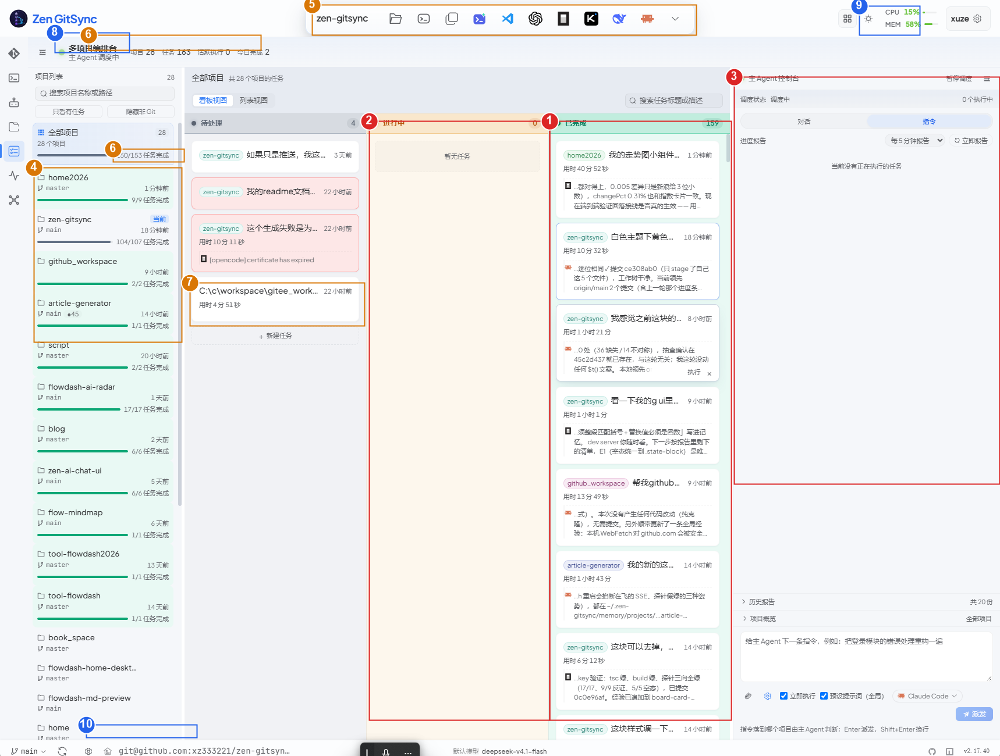
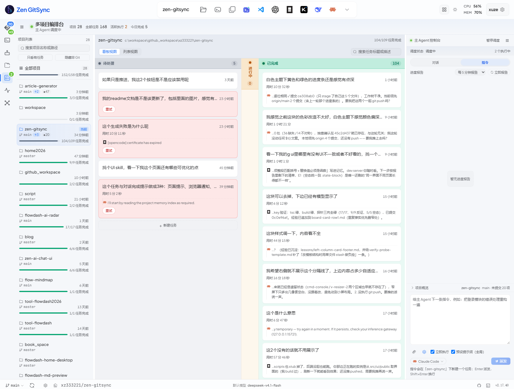
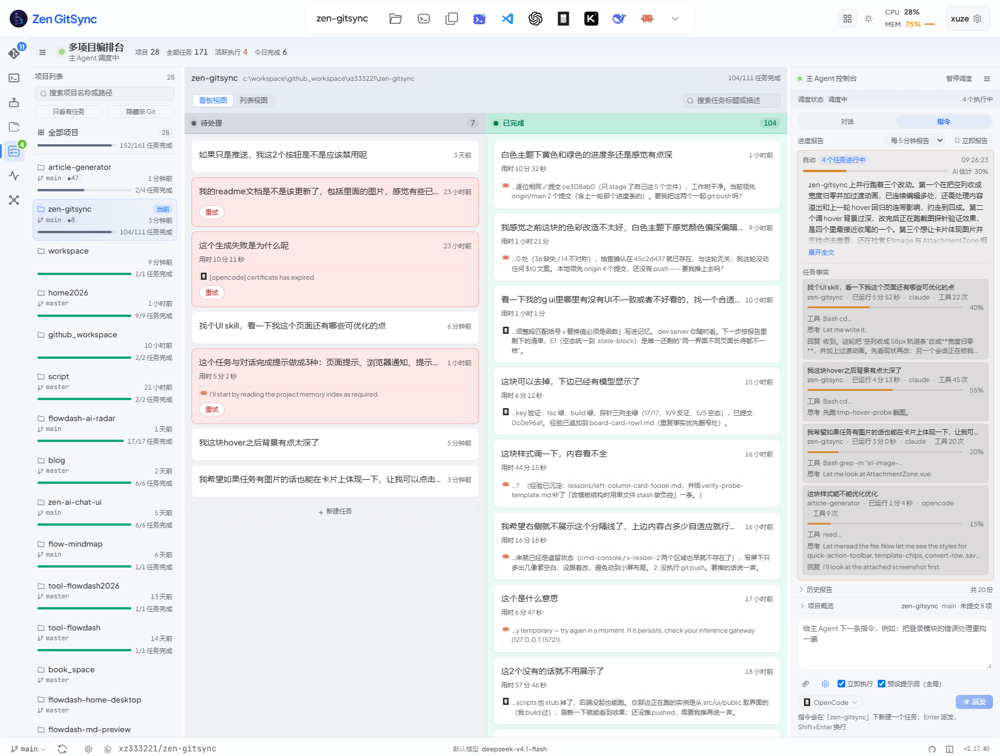

# 第六轮评审：编排台主界面（运行时截图量测）

日期：2026-10-05 · 方法：`$impeccable critique`（LLM 盲评 + 确定性检测器 + 本机对截图的像素量测）
对象：`多项目编排台` 主工作台满载态（浅色主题，28 项目 / 163 任务 / 0 在跑）



落地后（同分辨率 1718×1300、同一帧「进行中 0」）：

| 第一版（第八节）：空列收成 58px 竖排轨道条 | 第二版（第九节）：空列宽度归零 |
|---|---|
|  |  |

第二版是用户当轮反馈后的最终版（"没有内容的看板列可以宽度为 0 不展示，有了内容再展示，
加一些过渡动画"），**以第二版为准**；第一版留在图里是为了记住"58px 的竖排色带在整屏里
反而最扎眼"这个判断是怎么被推翻的。

**与上一轮的关系**：本轮不重复 `README.md` 里 ✅已修 与「故意没动」的条目。
重报的只有两处，均已在修复表标 ⬜ 未做，并在下文标注。

---

## 一、量测事实（不是感觉）

对 1718×1300 的运行时截图逐列取主色 + 边界扫描（`System.Drawing`，脚本一次性）：

| 区域 | 实测宽度 | 占屏 |
|---|---|---|
| 活动栏 | 52px | 3.0% |
| 左栏项目列表 | 264px | 15.4% |
| 中栏看板 | **940px**（`repeat(3, minmax(0,1fr))` → **每列 312px**） | 54.7% |
| 右栏主 Agent 控制台 | **458px** | 26.7% |

两处空白直接量出来：

| 空白块 | 尺寸 | 占屏面积 |
|---|---|---|
| 「进行中」整列（0 条任务，只有 312×90px 的虚线框渲染「暂无任务」） | 312 × 1030 | ≈14% |
| 右栏「进度报告」空态（`.oc__report-list` 有 `flex: 1 1 auto`，空态 `li` 顶对齐） | 458 × 700 | ≈14% |

**一屏约 28% 的面积在渲染"没有东西"。**

再看满载的那一列：`已完成 159`，卡片高约 130px（首行 + 用时行 + 3 行截断引文），
159 × 130 ≈ **2 万 px 的卡片栈塞在约 1030px 高的滚动区里 = 约 20 屏**。

---

## 二、P0

### P0-1 三列强制等宽：0 条的列与 159 条的列拿一样的宽度

`WorkbenchKanban.vue:231-233` `gridTemplateColumns: repeat(${columns.length}, minmax(0,1fr))`。

「进行中」0 条 → 独占 312×1030 的琥珀淡底；「已完成」159 条 → 挤在同宽的 312px 里，
每张卡标题和引文都被省略号吃掉。用户在这个页面上最常做的两件事（找失败卡、扫最近完成）
全部发生在这一列，而它没有比空列多拿到一个像素。

**修**：让轨道跟内容走 —— 空列塌成约 56px 的竖排轨道条（保留列头色带 + 计数，可点击展开），
让出的宽度按 `fr` 权重补给满载列；最低限度也可以给空列 `0.45fr`。改 `columnsStyle` 一处。
⚠️ 动手前先 `grep -n "kb-col\|kb__columns" scripts/` 对一遍几何断言。

### P0-2 「已完成」列无上限、无分组、无窗口化

`WorkbenchKanban.vue:331-334` 对 `col.tasks` 全量 `v-for`。159 张卡全部进 DOM。

仓库里**已经有**泛型虚拟滚动（`composables/useVirtualWindow.ts` + `utils/virtualRows.ts`，
被 `VirtualFileList.vue` 用着）—— 它要求**行高常量**，而看板卡是变高的（有无「用时」行 /
引文 1~3 行 / `has-error` 多一行），所以不是直接套用，要先统一卡高或改用估高方案。

**修**（按代价从低到高）：① 已完成列默认只渲染「今天 + 最近 N 条」，其余收进「显示更早的 137 条」；
② 按天分组，组头可折叠；③ 虚拟滚动。

### P0-3 右栏主输入区被 700px 空态压到底部

`OrchestratorConsole.vue:1389-1394` `.oc__report-list { flex: 1 1 auto }` +
`:1774-1780` `.oc-empty` 只有 20px 内边距 —— 空态被父级拉满，而文案 `idleHint`
（`:494-499`，三句话区分三种"没报告"的原因，写得很讲究）贴在顶上，看着像加载失败。

**修**：无报告时去掉 `flex: 1 1 auto`（`.oc__report.is-empty`），把高度还给下方
「历史报告 / 项目概览」或让 textarea 长到 6 行。

---

## 三、P1

### P1-4 同屏两个「任务数」差 10 条，界面不解释

- 顶栏「任务 163」= `WorkbenchBoard.vue:153` `boardTasks.value.length`（看板里全部任务）
- 左栏「150/153 任务完成」= `WorkbenchProjectPanel.vue:125-132`，各项目 `stats` 求和

163 − 153 = 10，两种口径都是"任务数"，界面上没有一处说明这 10 条在哪。
同一个 28 还在一屏里出现三次（顶栏「项目」/ 左栏标题 / 左栏「全部项目」行的「28 个项目」）。
（差额的具体成因本轮未追，只确认了口径来源不同。）

**修**：顶栏那一格删掉（左栏标题已有），或改文案 + `title` 写清口径。

### P1-5 左栏「已完成」整行铺绿，且与看板列身共用同一个令牌

`WorkbenchProjectPanel.vue:819-820` `.proj-item.is-complete { background: var(--role-done-surface) }`，
实测行底 = `rgb(233,249,244)` = `color-mix(--role-done-hue 9%, --surface-elevated)` ——
**和看板「已完成」列身用的是同一个令牌**。于是绿色在一屏里干四份活：列头色带、
列身氛围、计数 chip、进度条；截图上左栏有进度行的 11 个项目里 **10 个是完成态**（`n/n`），
整栏读起来是"绿底列表"，真正稀有的信号（在跑的琥珀）反而被稀释。

这跟第五轮已经写下的判据（`lessons/ui-design-tokens.md`：**能从这个东西所在的位置读出来的状态就别染**）
不一致：左栏行的完成态已经有进度条填满 + `n/n 任务完成` 两处表达。

**修**：完成态不染整行底色，让整行底只留给"在跑"和"有错误"这两种少数状态。

### P1-6 顶栏正中最醒目的位置给了 10 枚无标签图标

实测：顶部白色胶囊（全屏唯一带阴影的浮起物）里是 当前项目名 + 10 枚纯图标
（资源管理器 / 终端 / 各编辑器与 AI 工具 / …）。同一组「打开方式」在左栏项目行里是
**hover 才出的弹出菜单**（`WorkbenchProjectPanel.vue:453-454` 注释还写着「一行放不下七个图标」）——
同一个动作，一屏两种表述，且常驻的那版占着视觉中心。

**修**：常驻只留 2 枚（终端 / 资源管理器），其余收进 `…` popover；或每颗补一行 10px 文字标签。

### P1-7 卡片标题回退成裸路径

`WorkbenchKanban.vue:236-240` `cardTitle()` 在 `title` 为空时回退到 `desc`。
待处理列第 4 张卡因此整行标题是 `C:\workspace\gitee_work…`（截图中可见）。
左栏对同类值会取末段并与项目名对齐，卡面没有。

**修**：对形如盘符 / UNC 的回退值取末段，或直接不显示标题只留项目色标。

### P1-8 失败卡在静态屏上没有可见出口

`has-error` 卡的补救动作（执行 / 删除）在 hover 才浮出（`WorkbenchKanban.vue:472+`）。
截图里 2 张红底卡的唯一可见信息是「[openCode] certificate has expired」，
而"重试"要先把鼠标移上去才知道存在。

**修**：错误卡把「重试」提为常驻（它是这一屏唯一需要立刻决策的元素）。

---

## 四、P2

| # | 问题 | 位置 |
|---|---|---|
| P2-9 | 同为 ⬜ 未做项，截图证实仍在：**h1「多项目编排台」= 14px = 统计数字字号**，面板标题 12px = 列标题 12px，整屏没有一个元素比正文大两档 | `WorkbenchBoard.vue:931-932`（修复表 E2） |
| P2-10 | 同为 ⬜ 未做项，**这一屏就能看到三种空态**：进行中列虚线框 / 待处理列虚线按钮 / 控制台无边框灰字。`common.scss:925-1058` 的 `.state-block--empty` 已存在、已设计好、全仓只被 App.vue 用了 4 次 | 修复表 E1 |
| P2-11 | 「进行中」列头圆点在 0 条任务时仍然无限脉冲（`kb-pulse`，`WorkbenchKanban.vue:816-818`）—— 这一屏唯一的装饰性假信号 | 建议 `v-if="col.tasks.length > 0"` |
| P2-12 | 同屏两套进度条：项目进度条（`--role-*-bar`）与 CPU/MEM 占用条（`usageColor`）形状相同、语义无关 | `App.vue:663-710` |
| P2-13 | 底栏远程地址被硬截断成 `git@github.com:xz333221/zen-gitsync…`，11px 灰字，而它正是排错时要看的那条 | 建议改成 `owner/repo` |

---

## 五、检测器通道（含互相矛盾的一条，已核实）

`npx impeccable --json`（5 个页面文件）**12 findings**，只有两类：
`layout-transition` 6（全是 `transition: width`）、`bounce-easing` 6。
`side-tab` 已归零（上一轮整目录扫描是 23）—— 收敛是真的。

手工补充扫描：

| 发现 | 结论 |
|---|---|
| `ActivityBar.vue:427/463/486/527/566/591` 等 7 处 `color: #fff` | 低优先。徽标上的白字，能用但不合"别用纯白"那条 |
| `--ease-spring: cubic-bezier(0.34, 1.56, 0.64, 1)`（`variables.scss:512`）控制点 >1 | 回弹，父 skill 明令禁止。改令牌即可全局收敛，影响 6 处 |
| `transition: width` 6 处 | 性能非观感；但 `WorkbenchProjectPanel.vue:1130` 同时过渡 `width` 与 `background` |
| 4 个页面文件的 60+ 处 `infinite` 动画没有局部 `prefers-reduced-motion` | **误报**。`common.scss:11-20` 的全局 `@media` 用 `!important` 覆盖了 `*`，局部块本来就不需要（与上一轮 P2-18 同一结论） |
| 5 个重名 `@keyframes` | **误报**。全在 `<style scoped>` 内，vue-sfc 会给 keyframes 加 scope hash，零真实冲突 |
| `kb-card__reply` 的 2px 竖线 | **误报（故意）**。探针逐字断言，见修复表「故意没动的 2 处」 |

---

## 六、做对的地方（这轮别动）

1. **跨列状态染色 / 被列蕴含的状态不染**这条判据真的落到了像素上：待处理列 4 张卡里
   恰好 2 张红底，同列其余白底。这是本屏唯一一处"一眼挑出异常"的设计。
2. **左栏项目行的信息压缩率**：264px 宽、约 66px 高装下项目名 + 分支胶囊 + 相对时间 +
   进度条 + `n/n 任务完成` + 「当前」徽标，零装饰元素。
3. **派发栏那行 hint**（`OrchestratorConsole.vue:1113-1116`）：「指令落到哪个项目由主 Agent
   判断；Enter 派发，Shift+Enter 换行」—— 一句同时交付系统行为与键盘契约，全场最好的微文案。
4. **色彩系统有纪律**：`variables.scss:828-889` 七槽位 + 推导注释；本屏实测没有任何一处
   越界的硬编码底色（`#fff` 只在文字色上，不是色块源）。

---

## 七、建议动作（评审当时的排序）

按"改一处、收益一片"排序：

1. `columnsStyle` 空列塌缩（P0-1）—— 改一处，同时缓解 P0-2 的截断。
2. `.oc__report.is-empty` 去掉 `flex: 1 1 auto`（P0-3）—— 改一行。
3. 左栏完成态不染整行（P1-5）—— 与第五轮看板卡同一个判据，保持自洽。
4. 顶栏图标条收进 2 + popover（P1-6）。
5. 已完成列分段 / 折叠（P0-2）。
6. 顶栏数字口径统一（P1-4）。

> 实际执行与偏差见下一节。第 2 条就是执行时被推翻的那条：单看代码是"改一行"，
> 实测出来是"把 700px 空白从报告区搬到输入框"。

## 八、本轮落地（2026-10-05，同日晚）

上面那七节是**评**，这一节是**改**。逐条状态：

| 条目 | 状态 | 落地 |
|---|---|---|
| P0-1 三列强制等宽 | ✅→🔁 | 第一版：空的非待处理列收成 58px 竖排轨道条（列头仍渲染、仍吃那条 26% 色带）。实测 1718px 下另外两列 345 → **489px**（+42%）。**当轮被用户推翻，改成宽度归零 —— 见第九节** |
| P0-2 已完成列无上限 | ✅ | `DONE_PAGE = 30` + 列尾「显示更早的 N 条」续批（不是分页，点一次在当前列表尾巴续一批）。本机 160 条完成记录 → 看板里 `.kb-card` 从 **165 张降到 35 张** |
| P0-3 右栏空态吃 700px | 🟡 降级落地 | 空态**居中** + 换虚线框 + 输入框下限 76 → 168px。**没**做"把 700px 全给输入框"：实测那样输入框会长到 **798px**，一个只有占位符的巨框比原来那块空白更像"没做完"。真要利用它得在空闲时自动展开「历史报告」，那是行为改动 |
| P1-4 同屏两个任务数 | ✅ | 顶栏 `任务` → `全部任务`（+ title 说明含已移除项目的任务）；左栏进度行加 title 说明只统计列表内项目；删掉「全部项目」行里与 chip 重复的「28 个项目」。差额成因已查实：**10 条属于已从列表移除的项目**（9 条 `flowdash-ai-radar-demo` + 1 条容器目录） |
| P1-5 左栏完成态染整行 | ✅ | 删 `.proj-item.is-complete { background }`；`.is-running` 保留（只留少数状态染色） |
| P1-6 顶栏 10 枚无标签图标 | 🟡 只降权重 | 去掉了那枚浮起胶囊的 **180deg 渐变底 + 三段重阴影**（改走 `--surface-elevated` / `--shadow-sm`，两段 dark 覆盖随之删除）。**没**做结构收敛（只留 2 枚 + 「更多」popover）：会动到 `verify-open-with-permission-menus.cjs` 依赖的 `.simple-tool-trigger`，要连着改探针 |
| P1-7 裸路径当标题 | ✅ | `cardTitle()` 对盘符 / UNC 开头的 desc 只取末段 |
| P1-8 失败卡没有可见出口 | ✅ | 新增 `.kb-card__retry`（重试）常驻。**刻意不并进 `.kb-card__actions`**：那一组的宽度被 `verify-wb-card-fade-band` 按 96px 常数反推过渐隐距离；位置也只能在动作组之前（动作组是遮罩锚点） |
| P2-9 字号天花板 | 🟡 部分 | h1「多项目编排台」14 → **16px**（比统计数字大两档）。面板 / 列标题不动 —— 那条要先定信息层级方案 |
| P2-10 一屏三种空态 | ✅ | `.oc-empty` 换成与看板列、待处理列同一套的虚线框 + 淡底 + `--text-meta` |
| P2-11 空列脉冲点 | ✅ | 只在 `col.total > 0` 时打（`.is-live`） |
| P2-12 同屏两套进度条 | 🔁 已回退 | 当轮把 CPU/MEM 的条改成"低于 70% 不画"。同日用户指着顶栏回了一句「**还把之前的进度条展示出来吧**」→ 条恢复常驻，只保留"数字不上色"。见第十节 |
| P2-13 底栏远程地址截断 | ✅ | 显示 `owner/repo`（`xz333221/zen-gitsync`），完整地址进悬停提示；点击复制的仍是完整地址 |

### 连带的探针改动（改 UI 契约就得同步探针）

- **`verify-wb-card-reply.cjs`**：已完成列有上限之后，它挑的那张卡（按数据顺序取第一条"回复以问号结尾"的任务，实测落在第 **158/159** 位）不在 DOM 里了。加了一步"先点「显示更早的」把它翻出来，翻到底还没有才算真没有"。
- **`verify-wb-card-fade-band.cjs`**：fixture 的三张卡落在 待处理 ×2 / 进行中 ×1，**已完成列是空的** → 轨道一开，卡片变宽、引文从 3 行折成 2 行，"倒数第二行"换了一行，R3 那条逐像素断言的前提没了（墨 0px → 54px）。修法是把**列宽钉回三等分**（`addStyleTag` + `!important`）：这脚本量的是遮罩的像素，列宽本来就是个无关变量。

### 跑过的探针（最终状态）

全绿：`ui-consistency` 22/22 · `wb-colors` 12/12（+`--reverse` 6/6 该红的全红）· `wb-responsive` 36/36 ·
`wb-card-reply` 23/24 · `wb-auto-done` 17/17 · `wb-card-executor-icon` 39/39 · `wb-card-fade-band` 13/13（+`--reverse` 9/9）·
`wb-card-done` 28/28 · `wb-card-stop` 23/23 · `wb-card-opened` 17/17 · `wb-card-row1` 4/4 · `wb-list-view` 4/4 ·
`wb-proj-branch` 17/17 · `wb-proj-filter` 26/26 · `wb-dialogs` 19/19 · `open-with-permission` 7/7 ·
`wb-open-with-permission` 31/31 · `wb-copy-folder-name`（见下）· `i18n`（新 key 无缺）

**红的都不是本轮引入的**（已逐个 A/B 判过）：

| 探针 | 现象 | 判据 |
|---|---|---|
| `wb-task-duration` / `wb-card-live` / `wb-card-reply` 的 **F1** | 「fixture 与运行中后端的看板口径一致」漂移 1 条 `muui6u3u-mzykkt` | 那正是**发起本轮任务自己的 job** —— 磁盘快照说 running、内存里已终态。脚本注释里写明的固有偏差（`wb-card-executor-icon` 有这条豁免，另外三个没有） |
| `wb-card-live` 的 **A2 / D2** | 元信息行读不到执行器图标；静默色 180,83,9 vs 期望 230,162,60 | 把本轮改动整体关掉（轨道不生效）重跑，**同样红** → 与本轮无关。**第九节已查明是断言过期并修掉** |

---

## 九、空列改成宽度归零 + 过渡动画（同日第三轮 · 用户当轮反馈）

用户原话：**「我觉得没有内容的看板列可以宽度为 0 不展示，有了内容再展示，然后加一些过渡动画」**

第八节那版"收成 58px 竖排轨道条"被直接否掉。回头看，58px 错在两层：
**① 照旧占着 58×1030 的面积**；**② 那条竖排的角色色带在整屏里反而最扎眼** ——
26% 浓度的列头色带被拉满整列高，比"三列等宽"更抢眼。缩小尺寸的结果是更显眼。

### 做法

| 要点 | 落地 |
|---|---|
| 轨道 | 空列 `minmax(0, 0fr)`，有内容的列 `minmax(0, 1fr)` |
| **为什么不是 `0px`** | `0px ↔ 1fr` 跨了轨道类型（定长 ↔ 弹性），Chromium **不插值** → 直接跳变、动画等于没有。`0fr ↔ 1fr` 同类型，实测逐帧插值：`345 → 404 → 471 → 503 → 514 → 517 → 518px` |
| 裁剪 | `overflow: hidden` **常驻**在 `.kb-col` 上，不是只写在 `.is-collapsed`：展开那 300ms 里 class 已经摘掉了，而轨道才刚长到几十像素，不裁的话列头那 12px 内边距会糊到隔壁列上 |
| 过渡 | `.kb__columns.is-animated { transition: grid-template-columns var(--transition-slow) var(--ease-enter) }`；列自己过渡 `opacity` 与 `border-color`（分隔线走透明而不是 `none`，否则"啪"一下断开） |
| 首屏闸门 | `animateCollapse`：列的开合是**数据到了才定的**，第一帧三列都展开、数据一落就有一条塌下去，开屏抖一下像故障。两帧 `requestAnimationFrame` 之后再开过渡 |
| 无障碍 | 塌缩列 `aria-hidden="true"` + `pointer-events: none`（空列本来就没有可聚焦内容） |
| 窄屏 ≤860px | 竖排时没有"宽度"可让，改成 `height: 0`。**不用 `display:none`** —— 那会让这一列整个退出布局，而 `verify-wb-responsive` 的 W6e 是按"下一列 top = 上一列 bottom"量竖排顺序的，元素一没盒子它就读到 `top=0` 而假红 |

保留的两条例外与第八节一致：待处理列永不塌、三列都空时不塌。

### 实测（1718×1300，进行中 0 条）

```
模板 "518px 0px 518px"     todo 518px / doing 0px（盒子 1px = 透明分隔线）/ done 518px
doing: opacity 0 · aria-hidden true · pointer-events none · is-animated 已开
窄屏 780：三列竖排，塌缩列 height 0，W6e「第二列 top ≥ 第一列 bottom」成立
```

### 顺带修掉两条**早就红着**的断言（不是本轮引入）

- **`wb-card-live` A2** 断言活动区那行**文本里含 agent 名**（"claude"）—— 执行器早就改成
  只画图标了（图标↔执行器的映射由 `verify-wb-card-executor-icon` 的 39 条守着），
  文本里永远不会出现那个词，这条从改成图标那天起恒红。现在断言的是这一行真正该有的两样：
  时长文案 + 执行器图标位（图标在、title 有）。顺带记住：图标是 **``** ——
  `TaskExecutorIcon` 把 svg 当资源 import 进来，按 `<svg>` 找是找不到的。
- **`wb-card-live` D2** 期望 `--color-warning`，而 2026-10-04 的对比度修复（README P0-01）
  把状态色的**文字**一律换成了 `--color-*-dark`（`#e6a23c` 在面板上只有 2.05:1）。
  应用侧早就是 warning-dark，`verify:ui-consistency` 的"状态色不走 color:"那条也要求深色档。

### 并发会话提醒

本轮期间有另一个 session 在同一文件里写「卡片图片」功能（`BoardImage` / `cardImages` /
`kb-card__cover` / 新建 `scripts/verify-wb-card-cover.cjs`）。提交时用
`git diff` 拆 hunk + `git apply --cached` 只把自己的改动打进索引，**没有**把对方
在飞的半成品带进来（那份改动还横跨 `types/workbench.ts` / `projectRegistry.js`，
一起提交会让别人 clone 到编译不过的 main）。

## 十、顶栏 CPU/MEM 进度条恢复常驻（同日第四轮 · 用户当轮反馈）

用户原话：**「右侧这个还把之前的进度条展示出来吧」**（截图圈的是顶栏那对读数）。

第八节 P2-12 的推理**错在拿"隐藏"当解法**。当时看到的真问题只有一条 ——
「项目进度条和 CPU/MEM 条形状相同、语义无关」，但结论滑成了"那就别画"。
实际代价是：**水位是这排读数里唯一能一眼读出的东西**。数字 `8` 和 `61` 在
11px 灰字下是两串同形符号，条形长度才是"紧不紧张"的答案；把它藏到 70% 才给，
等于**只在出问题时才提供本来用来看出问题的那个东西**（用户截图那一刻 CPU 8% /
MEM 61%，一个条都没有）。

### 做法

| 要点 | 落地 |
|---|---|
| 条 | 去 `v-if`，`<div class="header-monitor__bar">` 常驻；顺带消掉"越过 70% 时读数区宽度跳一下" |
| 数字 | **保持第八节的做法**：低于 70% 不上色。彩色**文字**在高频位置确实吵，而彩色**小色块**不是一回事 —— 用户只报了条，没报数字 |
| 颜色 | `usageAlert`（文字档）之外新增 `usageBarColor`（实心档）：<70% 绿 / ≥70% 琥珀 / ≥90% 红，走 `--role-{done,active,error}-bar`。**不**沿用原来的 `--color-success`：实心色块不该继承文字的对比度预算，这条口径 README 第四轮已固化，`bar` 档比 ink 亮一档 |

### 实测（Playwright，`npm run verify:header-monitor`，29/29）

```
真实读数  CPU 8%  条 2.0px 绿 | MEM 54% 条 12.9px 绿
stub 复现用户那一帧  CPU 8% 条 1.9px 绿 | MEM 61% 条 14.6px 绿   ← 用户截图里的两个数字
越阈值       CPU 77% 条 18.5px 琥珀（数字同时变琥珀）· MEM 95% 条 22.8px 红（数字变红）
```

填充宽度 = 24px 轨道 × 读数，逐条对上（±0.1px）；fill 与轨道不同色、不透明。
场景 2 / 3 用 stub 把 8% / 61% 和 77% / 95% 两帧钉死，不靠"等机器闲下来"碰运气。


（用户截图那一刻：CPU 8% / MEM 61%，两条都在。机器跑满时 CPU 77% 那档是琥珀、
MEM 95% 是红 —— 见 `header-monitor-bar-restored-busy.png`。）

新探针 `scripts/verify-header-monitor.cjs`（`verify:header-monitor`）守 H1–H3。
它**没有 `--reverse`**：要反向就得把源码里的 `v-if` 注回去，不是注旧 CSS 能做到的；
而 H1 断言的正是"元素在不在"，元素不在时 `waitForSelector` 直接超时失败，天然会红。

`verify:ui-consistency` 22/22、`verify:wb-colors` 12/12 不受影响（后者 C5/C6
守的是 `--role-*-bar` 本身，本轮只是新增一个消费者）。


