# 一个字母「g」，承包了我所有的 Git 操作（2026 版）

> 备选标题：
> 《我用 2008 次提交，把 Git 变成了一句话的事》
> 《从 g 到 12 个面板：我的 Git 工作流只用一个工具》
> 《提交别说废话：zen-gitsync v2.16 实测一年半》

---

距离上一篇文章（《1900 次提交之后，Git 自动化变成了一句话的事》）已经过去大半年。zen-gitsync 现在迭代到 **v2.16.42**，累计提交 2008+，npm 周下载稳定在 1200+，最近一个完整月 5688 次下载。这一年多里我几乎每天都用它，最直接的感受是：**GUI 不再是 CLI 的图形翻译，而是把一连串"我接下来想做 A → 然后 B → 然后 C"的多步意图，压成单次点击**。这篇文章把那些真正在用的能力，按截图重新过一遍。

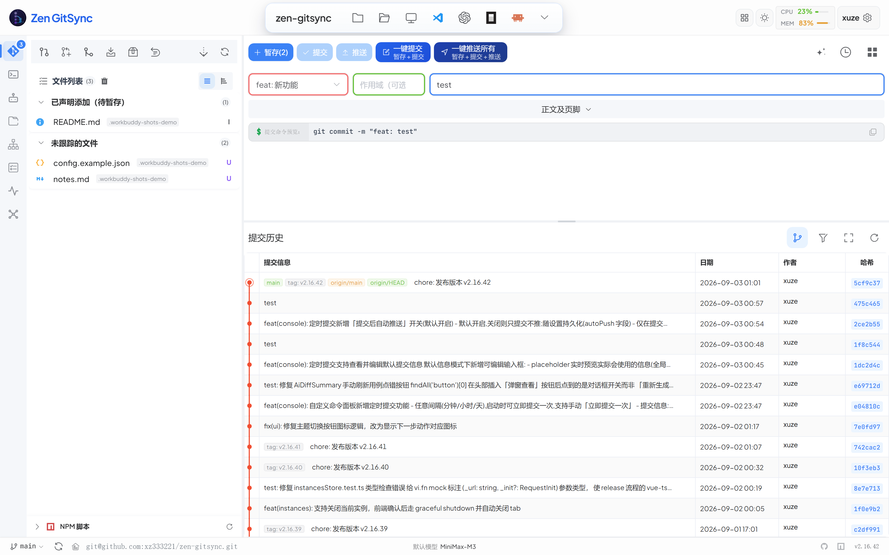

## 一个字母 g

老朋友。如果你已经读过上一篇文章就跳过这段——`npm i -g zen-gitsync` 之后拿到一个全局命令：

```bash
$ g                 # 暂存 + 提示输入提交信息 + 提交 + 推送
$ g -y              # 全部跳过提示
$ g -m "修复引导弹窗" # 直接传提交信息
$ g -y --interval=1800  # 每 30 分钟自动提交推送当前目录
$ g -y --path=~/notes --interval  # 后台同步某个目录
```

新增几条实用的小命令：

```bash
$ g --lock-file=config.json    # 锁住这个文件，工具永远不会暂存它
$ g --unlock-file=config.json
$ g --list-locked              # 看看锁了哪些
$ g ai "看下这个服务的 ERROR 日志"   # 启动终端里的 AI agent
$ g ai --model=2              # 切到第 2 个已配置的模型
```

`g ai` 在终端开一个 AI agent，能直接调命令、读文件、改代码、提交。它和 Web 端智能体用同一份会话存储——服务器把 `~/.zen-gitsync/agent-sessions/` 当作唯一数据源，两端写一起读一起。下面会再细说。

## GUI：四个主视图 + 四个辅助视图

`g ui` 启动后浏览器自动打开 http://127.0.0.1:5544，左侧 Activity Bar 一共 8 个视图，按打开顺序是：

| 视图 | 做什么 | 这次重点说 |
|---|---|---|
| Git | 日常暂存/提交/推送/历史 | ✅ |
| 控制台 | 自定义命令 + 内置终端 + **定时提交** | ✅ |
| 智能体 | Web 端 AI 聊天，CLI 与 GUI 会话统一 | ✅ |
| 文件空间 | Monaco 编辑器 + 文件树 + Markdown 预览 | ✅ |
| 源码地图 | AI 生成项目依赖关系图 | ✅ |
| 工作台 | 任务驱动的 Claude 批量执行 | ✅ |
| 系统监控 | CPU/内存/端口占用 + 一键 kill | ✅ |
| 思维导图 | Markdown 双向导入导出 | ✅ |

下面按使用频率挑了 8 个最值得说的能力，配 11 张截图，全部是 v2.16.42 实机、浅色主题。

### 1. Git 面板：单屏覆盖三个动作

打开仓库默认就是这张图。左边是按"已声明添加（待暂存）/ 未暂存 / 未追踪 / 冲突"分组的变更文件；右上角是结构化提交表单（`feat / fix / docs / style / refactor / test / chore` + 作用域 + 描述 + 正文 + 页脚），标准 / 自由两种模式可切换；右下是时间倒序的提交历史。**80% 的提交动作在这一屏里就能完成**，不用切 tab。

几个细节是我每天都在用的：

- **选择模式 = 限定范围**：勾选几个文件后，右上"AI 生成""一键提交所选""一键推送所选"的按钮文案会自动切到 "所选"，AI 也只基于勾选文件的变更推断提交信息。改完两个文件，勾选它们，AI 推断用途，直接推送，不再有"全选 → 提交"的走神时刻。
- **重置到远程**：一键 `git reset --hard origin/<branch>`。点击前会自动刷新分支信息，避免重置到陈旧分支；工作区干净且没有未推送提交时按钮自动隐藏，不会被误点。
- **结构化提交表单**：类型下拉里的选项直接对应 Conventional Commits，提交信息遵循规范自动拼装，配合上面的 AI 生成几乎不需要再敲字。
- **智能刷新**：窗口获得焦点、tab 重新可见，或者从 Activity Bar 切回 Git 视图时，自动静默刷新文件状态与分支信息。不用手动按 F5。
- **差异内预览**：diff 下方可以一键展开预览面板，`.html` / `.htm` / `.svg` 走沙箱化 iframe（允许 JS 执行，报告类页面的按钮/交互可用），`.md` / `.markdown` 走 Markdown 渲染，上下比例可拖拽，按项目保存。

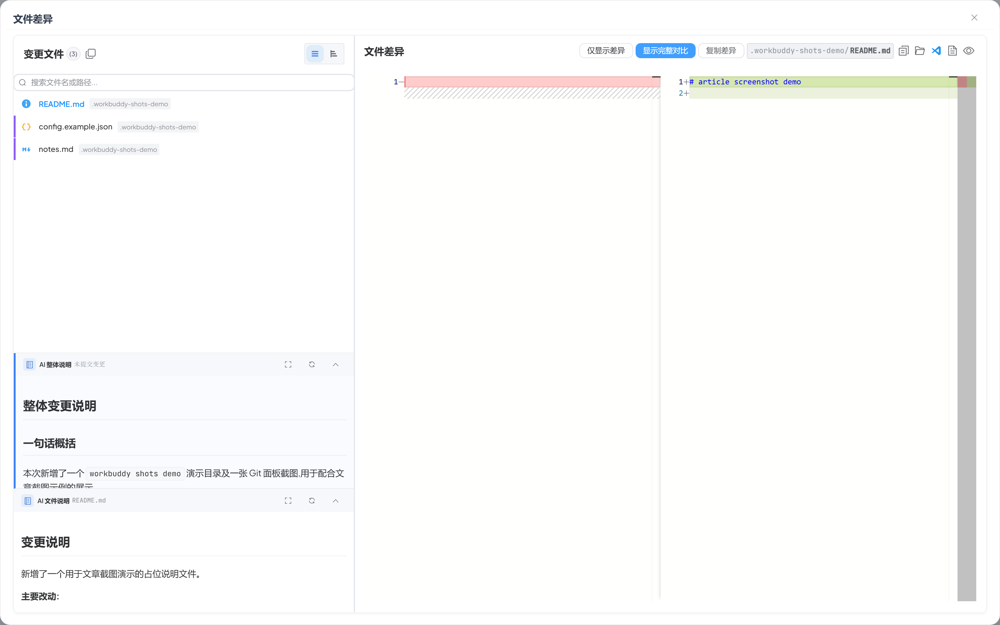

文件差异查看器是点击文件行弹出的全屏 Modal：左边是变更文件列表，右边是 Monaco 驱动的并排 diff，下方是"整体变更说明 / 一句话概括 / 主要改动"的 **AI 摘要**。三栏可拖动，按项目保存比例。

### 2. 控制台：自定义命令 + 定时提交（这一版新加的）

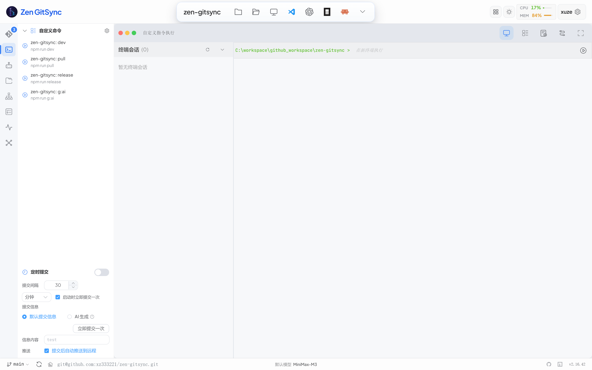

左侧是保存的自定义命令（命名 + Shell 命令 + 工作目录 + 参数），点击就在右侧独立终端会话里跑，输出通过 SSE 实时回传，Windows 走 `cmd.exe`，Unix 走 `sh`，支持多个会话并行。

底部的 **定时提交** 是 v2.16 新加的：勾选"定时提交"开关 → 设置间隔秒数 → 选"分钟"或"启动时立即提交一次" → 提交信息用默认提交信息或点 AI 生成 → 勾上"提交后自动推送"（默认开启）→ 立即提交一次按钮触发首次。

这就把"打开电脑 → 让某个目录每隔 N 分钟自动暂存/提交/推送"做成了一个 GUI 选项。配合每用户态开机启动文件夹里放几个快捷方式，剪贴板里几个零散笔记、改动 .zshrc、临时写的小脚本，都能悄悄跟着 commit 走。

每条命令都有独立的 enable/disable 开关，可以预先排好一组动作而不立刻跑。`ProjectStartup` 还能让打开仓库时按顺序跑命令 + 工作流，相当于"项目启动钩子"。

### 3. 可视化流程编排：拖拽画布

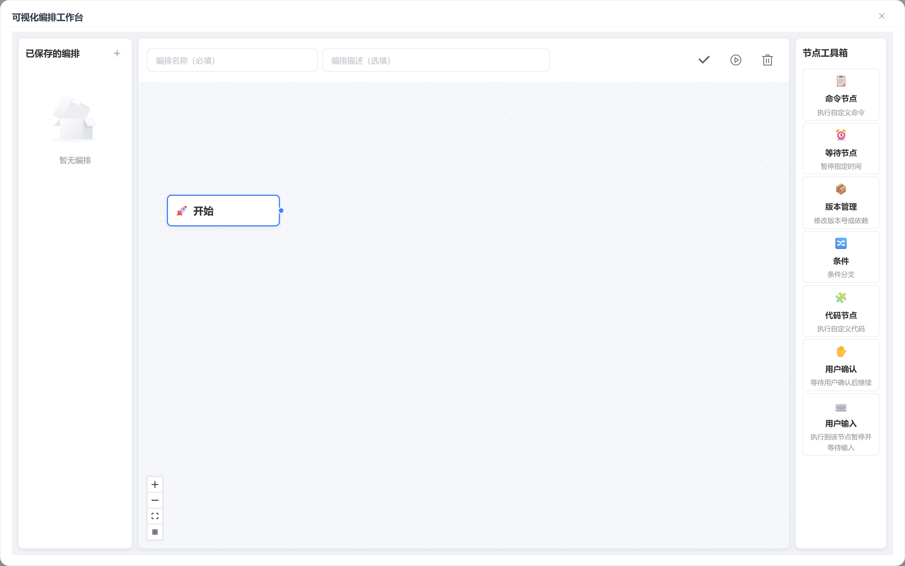

控制台顶栏还有个紫色按钮"可视化编排"，点开就是拖拽画布。节点工具箱在右侧：

- **命令节点** — 执行一条已保存的自定义命令
- **等待节点** — 暂停 1–3600 秒
- **版本节点** — 修改 `package.json` 的 patch/minor/major 或依赖版本
- **条件节点** — 按条件决定走哪条分支
- **代码节点** — 执行自定义 JS 代码
- **用户确认 / 用户输入** — 暂停等人工

每个节点可独立启用/禁用，流程按拓扑顺序执行。我搭过一个"每日构建流"：更新依赖 → 等待 5 分钟落盘 → 构建 → 部署 → 版本 +1。整套流程画一次，之后点执行就行。

### 4. 智能体：终端 `g ai` 和 GUI 会话是同一份

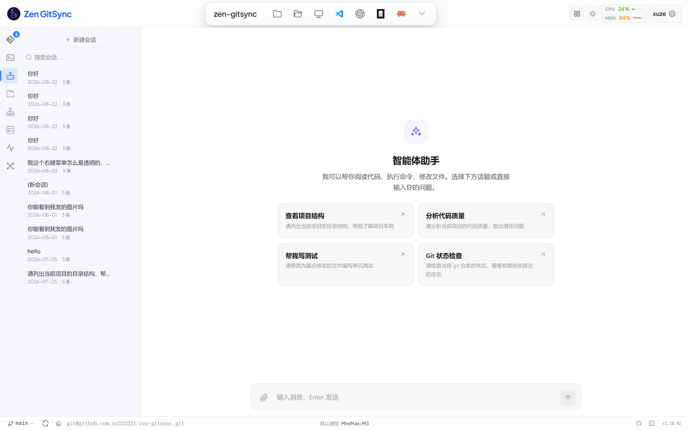

左侧是会话列表，**Web 端和 CLI 端 (g ai) 创建的会话出现在同一列表里**——终端会话带 `CLI` 角标。右侧是完整的对话界面，支持流式输出、思考过程、工具调用可视化（run_command / read_file / edit_file / list_files / search_text / write_file 都以可折叠卡片渲染）。

会话保存为 JSON 文件到 `~/.zen-gitsync/agent-sessions/`，CLI 端（`g ai`）写同一目录，Web 端与 CLI 端会话统一管理。容器里排查问题我用终端直接动手（`g ai "看下 ERROR 日志"`），回到工位在 GUI 里继续追问上下文——两端不用粘来粘去。

如果还没配置模型，`g ai` 会启动交互式配置向导：选服务商 → 选模型 → 输 API Key → 测连 → 完成。↑↓ 切换 + Enter 确认；非 TTY 环境自动回退数字输入；Esc/Ctrl+C 随时取消。

### 5. 文件空间：Monaco 编辑器 + Markdown 预览

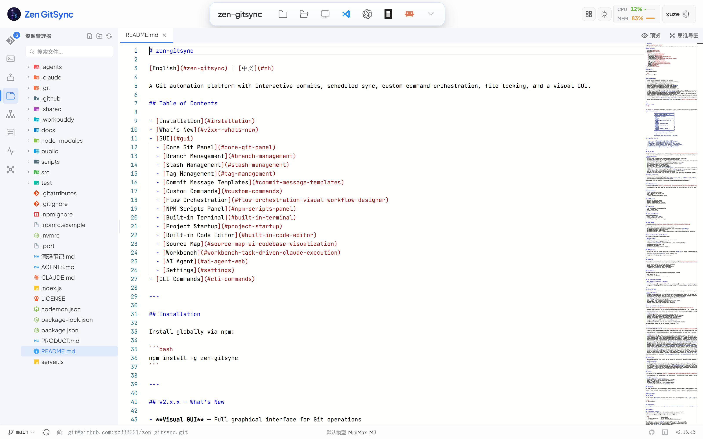

第二个 Activity Bar 视图，不离开 GUI 就能改文件：

- 文件树每 15 秒自动刷新（捕获 GUI 外的改动），标签页隐藏或搜索框非空时跳过；搜索框 180ms 防抖，命中片段在节点名中高亮，`Ctrl/Cmd+F` 聚焦，`Esc` 清空
- 多标签页，未保存文件显示 ● 标记
- Monaco 语法高亮（JS/TS/Vue/Python/Go/JSON/CSS…）
- `.md` 一键切换源码/渲染预览（同一组件，渲染体验与编辑器一致）
- `Ctrl+S` 保存，编辑器主题跟随全局明/暗
- 内联新建 / 重命名 / 删除文件或文件夹

### 6. 源码地图：AI 把模块依赖画出来

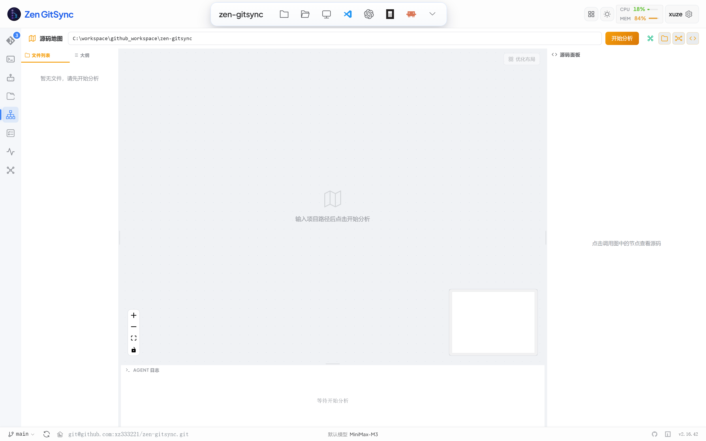

第三个 Activity Bar 视图。点右上"开始分析"，文件内容会发给配置好的 LLM，三栏布局：

- 左：文件树
- 中：可交互依赖图（拖拽、缩放、fit-view、minimap）
- 右：节点对应的源码预览（Monaco）

图上自动聚类出颜色区分的子系统、标记主入口文件和入口函数、检测技术栈。**老实说我自己一周开不到一次**——日常理解代码靠 GitNexus（项目本身就用它索引和增量分析），这块对我更像"急救工具"，接手别人代码库时偶尔拉一下。但既然花了功夫做出来，文章里不硬推没用。

### 7. 工作台：批量调度 Claude

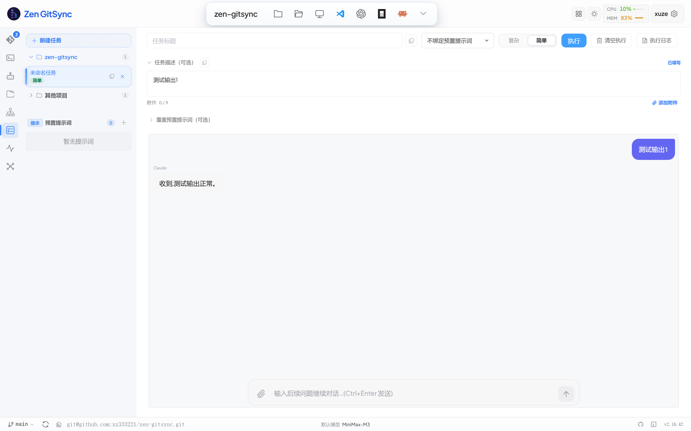

第四个 Activity Bar 视图。定义一个任务 → 拆成有序子任务 → 绑定可复用的提示词预置 → 点"执行任务"，按顺序依次跑。子任务附件支持图片 / PDF / 文本 / Markdown / CSV / JSON / log，单个 ≤ 5 MB；图片右键可直接复制到剪贴板。

最关键的切换的**每个子任务独立启动 `claude --permission-mode bypassPermissions` 进程**，上下文与状态不会跨子任务累积。提示词预置里有 `{{task.title}}` / `{{task.desc}}` / `{{sub.title}}` / `{{sub.desc}}` / `{{repo.path}}` / `{{branch}}` 变量插值；"新建预置"对话框里有个 **AI 生成项目架构说明** 按钮——服务端递归识别所有子项目（含 `.git` 或 9 种 manifest 之一的目录），并发调 LLM 产出各子项目架构说明，最后合并成一份整体说明。多子项目 monorepo 也能用。

任务类型支持"简单 / 复杂"切换，复杂任务下有 AI 拆分按钮（带 sparkle 图标 + pulse 动效）。简单任务执行完可以续聊——点退出按钮清空对话回到 idle，输入新内容用 `claude --resume <session_id> -p` 接着上次。

提示词预置与任务数据持久化到 `~/.zen-gitsync/prompts.json` 和 `~/.zen-gitsync/tasks.json`，跨项目共享。

### 8. 系统监控：CPU / 内存 / 端口 / kill

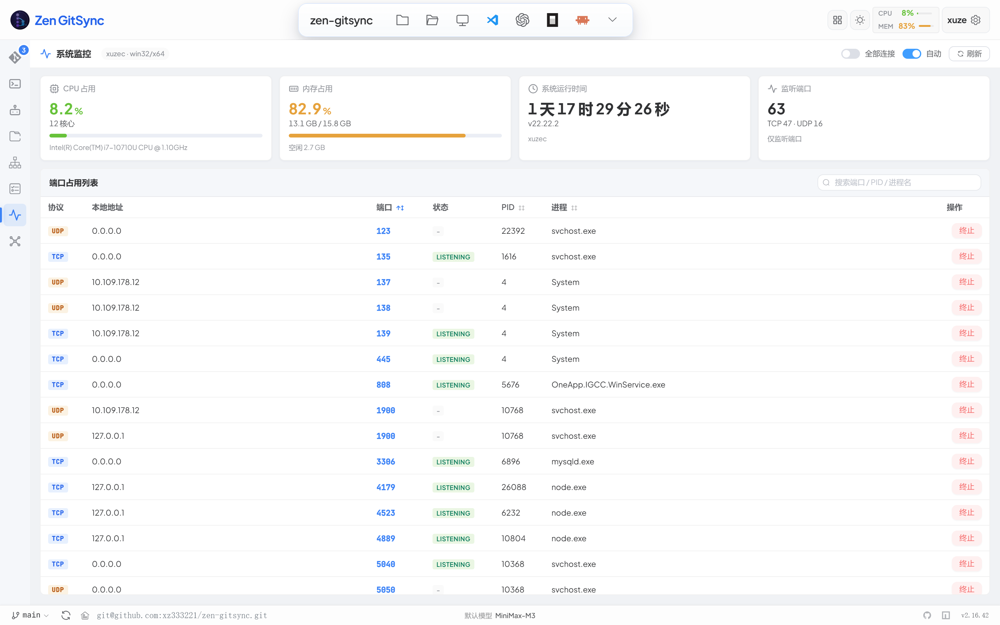

第七个 Activity Bar 视图。顶部四张卡：CPU 占用 / 内存占用 / 系统运行时间 / 监听端口数。下方"端口占用列表"按端口号排序，点"终止"按钮一键 kill（Windows 下用 PID），搜索框支持按端口 / PID / 进程名过滤。

旁边有"全部连接 / 自动 / 刷新"开关：手动模式下不会自动轮询，避免误杀；自动模式每 5 秒刷一次。`顶部条的 CPU / MEM` 是常驻展示——任何视图下都能瞄一眼，不用来回切。

### 9. 思维导图：想清楚再写

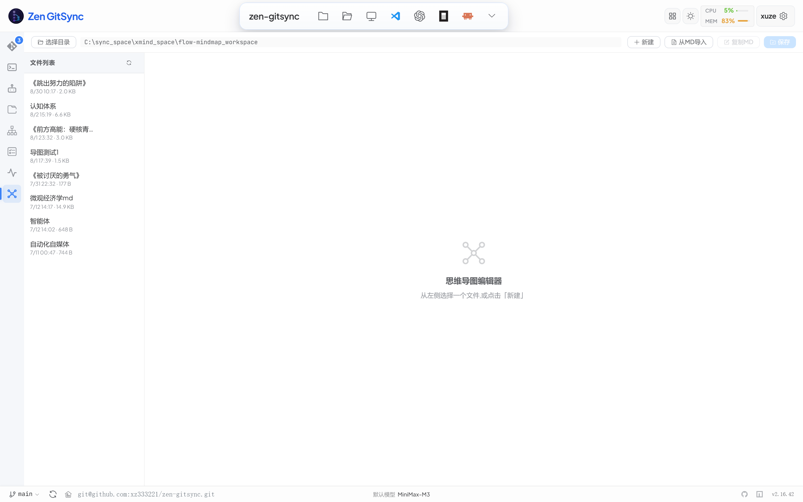

第八个 Activity Bar 视图。支持 Markdown 双向导入导出，根的每条分支都能折叠展开。先在图上把结构搭起来、想清楚再落正文，比直接开文档低头写顺畅得多。"认知体系"那张图就是围着"怎么把 Git 自动化做成一件事"长出来的初稿，后来它真变成了这个项目。

### 10. 设置：AI 模型 tab 是核心

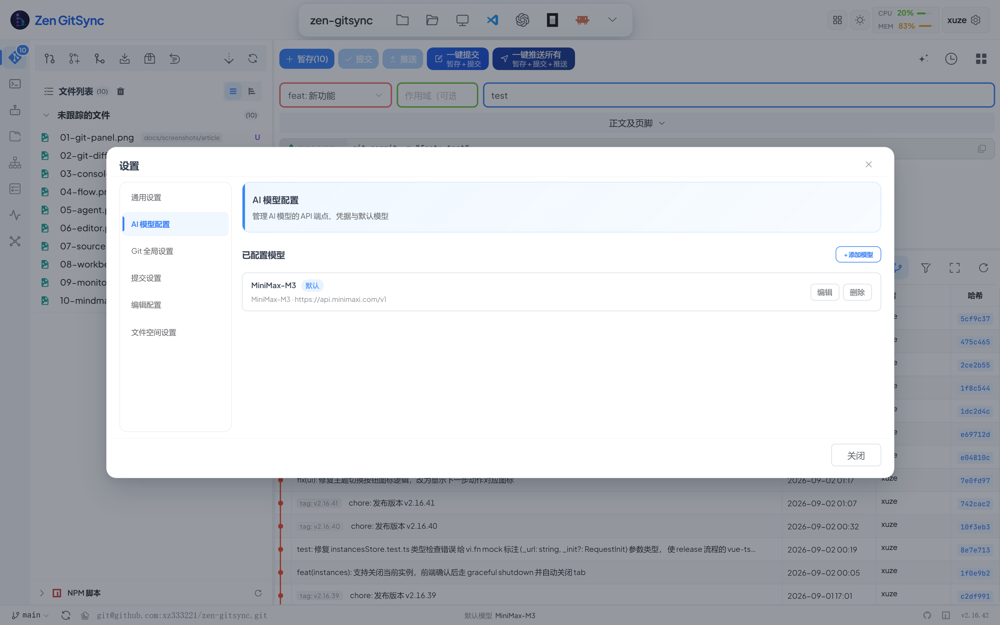

顶部条齿轮按钮点开。tab 包括：**通用 / AI 模型 / Git 全局 / 提交 / 编辑 / 文件空间**。大部分开关即时生效，无需重启 GUI。

AI 模型 tab 集中管理多套兼容 OpenAI 协议的 LLM（OpenAI、Anthropic、DeepSeek、自部署等），每个模型独立存 baseURL / API Key / 模型名，可标记"默认"。底栏的"默认模型"名称点击后一键定位到这个 tab。

`g ui` / `g ai` / 提交时 AI 生成提交信息 / 工作台 Claude 调度 / 源码地图 / 整体变更说明摘要——只要用到模型的能力，都读这套配置。

## 几个在意的细节

**冷启动更快。** Monaco、`@vue-flow`、`flow-mindmap`、`dagre` 都拆成独立 chunk 并按需懒加载，Git 面板首屏不再等编辑器或编排器。实测从 `g ui` 到能提交大概 1.5 秒。

**网络错误横幅。** 后端不可达时全局顶部弹出横幅，显示"X 分钟前最后成功 / 当前不可达"，点"重试"自动重新建连。

**无障碍（WCAG 2.1 AA）。** 弹窗焦点陷阱与归还、`role="separator"` 键盘可达的分隔条、纯键盘 (`← → ↑ ↓`) 调整面板宽度、屏幕阅读器友好的提交右键菜单、ARIA-pressed 切换按钮、提交按钮在提交过程中挂 `aria-busy`、Git 提交哈希在明/暗主题下对比度均 ≥ 4.5:1。

**中英双语 / 明暗主题切换。** header 一键切换主题，无需进设置。语言切换也即时生效，词条用 `$t('@命名空间:原文')` 取，命名空间隔离避免撞名。

**NPM 路径。** 设置里配扫描根和排除规则，Git 面板左下角的 NPM 脚本面板按需扫描仓库内所有 `package.json`，按包分组列出 scripts，脚本名点一下就在内置终端里跑。

**提交模板。** 类型 / 范围 / 描述 / 完整消息四类模板保存复用，"填提交信息"变成"挑模板 → 改一改 → 提交"。

**多实例 + 关闭当前实例。** 同机开多个仓库每个占一个端口，header 上的实例切换器一键跳。如果某实例开着定时同步 / 后台任务，关之前会弹确认，避免误关丢状态。

## 自升级：检测到新版本点一下就升完

底栏版本号每个会话向 npm 查询一次最新版本，检测到更新时版本旁出现"升级"按钮。点击后弹窗实时回传 `npm install -g zen-gitsync` 的输出；成功后弹窗切到"立即重启并刷新" CTA。后端调用 `POST /api/app-restart` **自行 spawn 新 Node 进程**（不依赖任何外层 launcher / 桌面壳），通过 NDJSON 把新进程端口推回前端，旧进程再优雅退出；浏览器重定向到新端口（保留当前 path / query / hash），由新后端服务后续请求。底栏版本号会立刻刷新到新版本号，重启前就能看到。若子进程 8 秒内未就绪，旧进程不退出并弹错误提示，会话保持连接。

> macOS / Linux 上全局安装需要 sudo，前端会用 `sudo -n` 非交互式尝试；如非免密 sudo，请以管理员权限重启 GUI 后再试。

## 安全：只监听回环 + Origin 白名单

GUI 服务默认只监听 `127.0.0.1`，没有认证层。一旦绑到 `0.0.0.0`，命令执行 / 写 `package.json` / 用系统关联程序打开文件这些接口对同网段任何主机都是可调用的。需跨机访问显式放开：

```bash
$ ZEN_HOST=0.0.0.0 g ui      # macOS / Linux
$ $env:ZEN_HOST="0.0.0.0"; g ui  # PowerShell
```

监听收敛到回环地址后，剩下的主要入口是本机浏览器里的恶意页面——跨站 fetch 或 DNS rebinding 都能打到这些接口。所以对所有 `/api` 请求做 Origin 校验：`localhost` / `127.0.0.1` / `[::1]` 的任意端口放行，`file://` 页面（`Origin: null`）放行，其他来源 403。需要放开额外来源时用 `ZEN_ALLOWED_ORIGINS`（逗号分隔的完整 origin，含协议与端口）。

## 命令行一览

```bash
$ g ui                       # 启动 GUI
$ g                          # 交互式提交
$ g -y                       # 全跳过提示
$ g -m "修复弹窗"             # 直接传提交信息
$ g -y --interval=1800       # 每 30 分钟自动提交推送当前目录
$ g -y --path=~/notes --interval  # 后台同步某个目录
$ g --cmd="echo hello" --cmd-interval=5 --at=21:00    # 定时执行任意命令
$ g --lock-file=config.json  # 锁住文件，工具永远不会暂存它
$ g ai                       # 终端 AI agent（与 GUI 智能体统一会话）
$ g ai "看下 ERROR 日志"      # 单发任务
$ g ai --model=2             # 切第 2 个已配置的模型
$ g log                      # 格式化 git log
$ g get-config               # 当前配置
$ g -h                       # 帮助
```

## 安装

一行：

```bash
npm install -g zen-gitsync
```

任意仓库里试这一个字母：**g**。

项目地址：https://github.com/xz333221/zen-gitsync

如果觉得有一点用，欢迎 Star；有任何想法或 Issue，我都在。

> 说明：正文图片为**相对本文件（`docs/`）的路径**（`screenshots/article/0x-*.png`），图片实际存放在仓库的 `docs/screenshots/article/` 目录，IDE 预览与 GitHub 均可直接渲染。粘贴到公众号编辑器前，请将该目录下的 PNG 上传到微信图文或你的图床，再替换 Markdown 中的图片 URL 为线上地址。