# 一个字母 g 管 Git，一块看板管 28 个项目的 AI 员工

> 备选标题：
> 《2407 次提交之后：我把 AI 编程收编进了一块看板》
> 《28 个项目、78 个任务、一块看板：我的 AI 编程总控室》
> 《从敲命令到派活：zen-gitsync v2.18 实测》

距离上一篇《一个字母「g」，承包了我所有的 Git 操作》过去了大半年。

zen-gitsync 迭代到 **v2.18.1**，累计提交 **2407 次**，npm 上周 3246 次下载、最近 30 天 10678 次 —— 比上次写文章时翻了一倍还多。

但这半年里，我自己打开最多的已经不是 Git 面板了，是**工作台**。

准确说，是工作台里那块看板：

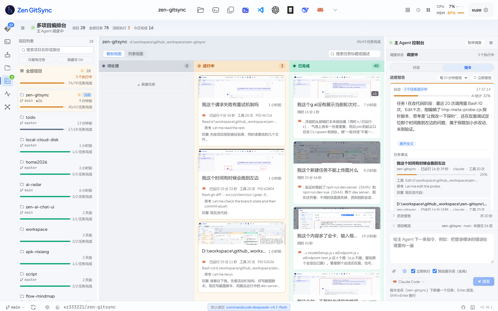

左边是我本机 28 个项目，中间是 78 个任务的三列看板，右边是主 Agent 控制台。

我现在的开工流程变了：先扫一眼这块板子 —— 昨天夜里哪些跑完了、哪些卡住了、卡在哪一步；然后把今天要干的事，一句话一句话丢进右下角那个输入框。

这篇文章按截图把这一版我真在用的东西过一遍。**前半篇是工作台**（这半年的全部重心），Git 面板和其余视图在后半篇，老读者可以直接跳到第二节。

---

## 一、工作台：一句人话，落到正确的项目里

上一篇文章里，工作台还只是"一个任务列表 + 一个执行按钮"。那时候我用它跑单项目的大改动，用完了就关。

真正的转折是项目变多之后。我同时在做 zen-gitsync、todo、home2026、ai-radar、local-cloud-disk……每个项目开一个终端、盯着三四个 Claude 来回切窗口，最后瓶颈变成了我自己：**我能并行开的窗口数是有限的，而我想推进的事情不是。**

现在这个视图的官方名字叫「多项目编排台」，界面上一共三块：

- **左：项目列表** —— 每个项目一行，带当前分支、未提交数、以及"x/y 任务完成"的进度条，一眼看出哪个项目在动、哪个晾着
- **中：看板** —— 待处理 / 进行中 / 已完成 三列，任务卡片直接显示执行状态
- **右：主 Agent 控制台** —— 就是那个输入框，你把指令丢给它

### 1. 派发：不用选项目，也不用选任务

右下角那个框，直接说人话就行：

> 把设置里 AI 模型那块的表单校验补一下

回车。主 Agent 会自己判断这句话该落在哪个项目上、要不要新建任务，然后建好开跑。**你不需要先选项目、再选任务、再点执行** —— 那是上一版的流程。

当然你也能自己指定：左栏点中哪个项目，指令就默认落在哪个项目。输入框下面一行小字会实时告诉你它准备落在哪：

```
指令会在「zen-gitsync」下新建一个任务；Enter 派发，Shift+Enter 换行
```

三个附带的开关我一直在用：

- **立即执行**（默认勾上）—— 取消勾选就只建任务不跑，等于快速记 TODO。适合开会时随手记："等下要做的事"。
- **暂停调度** —— 控制台右上角。挂起之后派发仍然建任务，但一律不执行。晚上不想让它自动开工就按这个。
- **预设提示词（全局 / 本项目）** —— 每个任务前面自动挂一段固定话。全局那段对所有项目生效，每个项目还可以再挂一段自己的（是追加，不是替换）。我的全局那段写着工作区约定、禁止事项、提交规范；某个项目那段写着这个项目的目录结构和测试命令。单次派发可以勾掉它。

### 2. 卡片在直播，不用点进去看

看板中间那列是我最喜欢的部分。一个任务在跑的时候，卡片背面站着一整套事实：

- 用的是哪个 CLI（卡片头上一枚品牌小图标，鼠标悬停出全名）
- **已运行**多久
- **工具调用了几次**（悬停看类型分布）
- **最近一次工具调用**是什么
- **最近在想什么**（模型的思考流）
- **最新一句回复**是什么
- 如果它已经安静了一段时间，还会给出**静默时长**

这些不是前端瞎猜的，全部来自执行日志 —— 和右栏那份进度报告读的是同一份数据，所以是 5 秒一次跟着真实进程刷新的。

于是"我该不该管它"这个判断，不用点开任何东西：卡片上写着 `已运行 16 分 47 秒 · 工具 20 次 · 思考 Let me edit the probe. · 回复 现在改代码：`，看着就是在干活；而一张写着自己已经**静默 4 分**、工具调用停在同一处的卡，就是该看一眼的。

顺手两个动作：

- 鼠标移到进行中的卡上，会浮出**停止**按钮。以前要杀一个卡死的任务，得点进任务编辑器、滚到最底下、再点停止，现在在板子上就能按。
- **已完成**那一列不只显示标题和时间，还会留一句**这条任务最后说的话**（截 100 字，前面带执行器图标）。这个设计有个真实理由：任务跑完停在"要不要我 push？"这种反问上，是最常见的收尾方式。任务在"已完成"列不代表它不需要你，以前只能点进去翻日志才知道它在问什么。下面这张就是已完成列 —— 带截图附件的任务还会在卡片顶部铺一张封面，点开看大图、方向键翻下一张。

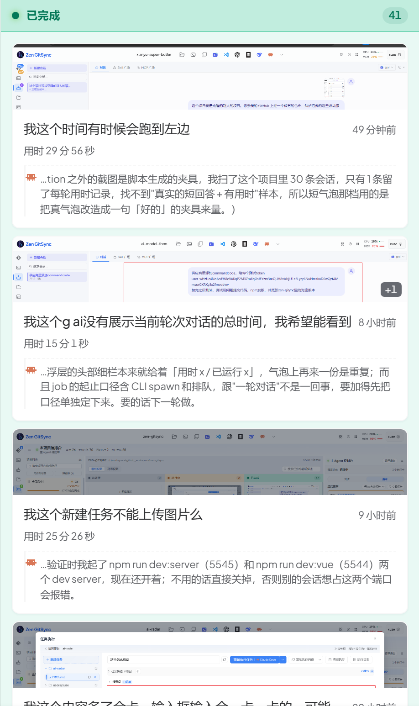

### 3. 进度报告：不是"派了什么"，而是"现在到哪了"

右栏的指令面板里有一块**进度报告**。它不是把看板上的信息再列一遍，而是让主 Agent 真正去读每个在跑的任务 —— 已运行多久、最近在想什么、工具调用是什么组合、安静了多久、最新输出是什么 —— 然后写一段话告诉你：每件事进行到哪了、看起来卡没卡。

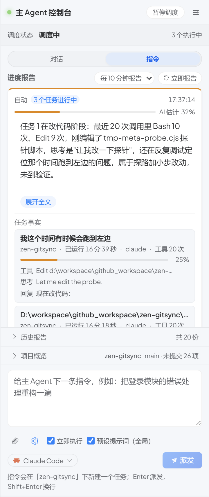

每条报告带一根进度条：模型给出它自己对整体进度和每个任务的**估算**，标签直接写"**AI 估计**"，不装成精确测量。模型不肯给数字的时候那根条就不画，而不是默认画成 0%。

这套报告真正的价值，建立在一个事实上：**绝大多数任务从头到尾不输出一行正文** —— stdout 是空的，你只能看见一个 PID 还活着。是**思考流**把它们讲清楚的。所以"看起来卡住了"这句判断现在必须带证据 —— 一段静默时长，或者工具调用在原地打转 —— 而不是因为"调用次数高"就下结论。

配套三件事，都是这半年踩出来的：

**它自己会判断跑完没跑完。** 一条任务静默超过 10 分钟（没正文、没思考、没工具调用），控制台就问主 Agent 一次：读到的事实够了没有，这条是跑完了还是在磨。判"跑完了"就把那张卡从进行中挪到已完成，时间旁边挂一枚「AI 标记完成」，悬停能看到它的理由。证据不足时**它什么都不做**（只记账，再等 10 分钟，最多问 3 次）—— 不动作好过把正在跑的任务标成完成。它只改记录，从不杀进程：真要终止还是按卡片上那个停止。

**报告只在它还成立的时候占着主位。** 报告是"生成那一刻"的快照，任务跑完之后，卡片上那句"3 个任务进行中"就成了假话。所以这些任务一结束，主位就换掉它，改成说真话的一句：「当前没有任务在执行」或者「正在跑的任务还没有进度报告」。想看旧报告从**历史报告**里点，回来时会打上「已完成」的标记。

**报告是服务端生成的。** 你关掉标签页它照样按点攒，回来接着看。没任务在跑就不落空报告，「立即报告」会直接回你"现在没有任务在跑"，而不是塞一条空的进去浪费一次模型调用；几秒内重复点也不会产生两条一样的。间隔自己挑：5 / 10 / 15 / 30 / 60 分钟，或者关掉。

### 4. 看板不止是"它说了算"：你能改它的结论

看板的三列是从执行事实推出来的，而有两件事只有你知道：**一件其实是别处干完的**，**一件模型已经不吭声了但你看得见它成了**。

所以待处理和进行中的卡片悬停时会多一个**标记完成**按钮。手工标进"已完成"的卡，那个位置换成**撤销**（一次点击，不弹确认 —— 它就是给"点错了"准备的）；自己跑完的卡两个都不显示，因为撤销一个它从来没有过的标记，什么也不会发生。给还在跑的任务手工标完成会先问一句，确认后顺手停掉那次执行（一张卡不能既是已完成又在跑），跨窗口也成立 —— 任务如果活在另一个 `g ui` 窗口里，服务端会直说这个原因，而不是假装成功。

### 5. 让任务带着"上一个人踩过的坑"开工

这是我认为整个工作台里最不像功能、但最有用的一件事。

工作台上每个派出去的任务，开工前都会被告知本机有一个**跨轮记忆库** `~/.zen-gitsync/memory/` —— 同一个仓库里，之前那些 agent 留下的经验。

它刻意做成**两级**：

- 只有 `INDEX.md`（每条经验一行、不超过 100 字）会进提示词
- 经验正文放在 `lessons/*.md`，**命中索引行、真的相关时才去读**

不预加载、不读 `archive/`。这个设计就是全部要点所在：把索引整段塞进每一次派发，等于让每个任务都为所有不相干的历史经验付一遍 token。

那个"写"的部分是硬约束的。每个 agent 收工前要自问四个问题 —— 这轮卡了 3 分钟以上或者走了 A→放弃→B 的死路？用错了工具 / 写错了文件 / grep 被构建产物淹没？你纠正过它？发现了一条反直觉但验证有效的捷径？任意一条成立，就写**一条**经验，并且**必须**把索引行补上 —— 一条没有索引的经验，就是一条谁也不会发现的记忆。

这半年的积累，现在已经 60 多条了：

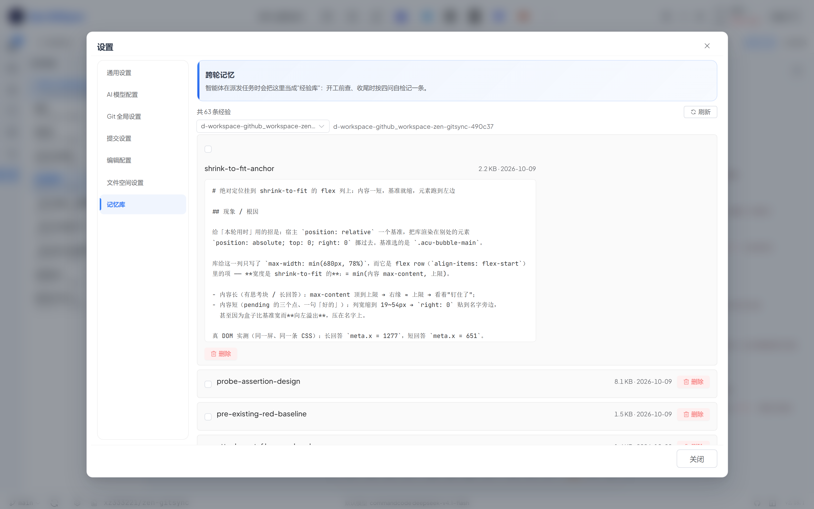

`设置 → 记忆库` 能直接翻这个库：范围选择器里是两份全局文件和每个跑过 agent 的仓库（按真实路径分组），点标题展开正文。删一条经验会**连索引行一起删掉** —— 留一行指向不存在的文件，等于给后面的 agent 挖坑；而本来就没写索引行的条目会被标上「未被索引」，因为 agent 永远找不到它。`GLOBAL.md` 和 `INDEX.md` 本身删不掉，它们是账本。

单个任务可以设 `memoryContext: false` 整个关掉。不过说实话，我关掉一次之后就再没关过。

### 6. 单条任务内部：每个任务一个干净进程

点开任意一张卡片，就是任务编辑器 —— 它盖在板子上方，板子在下面继续跑：

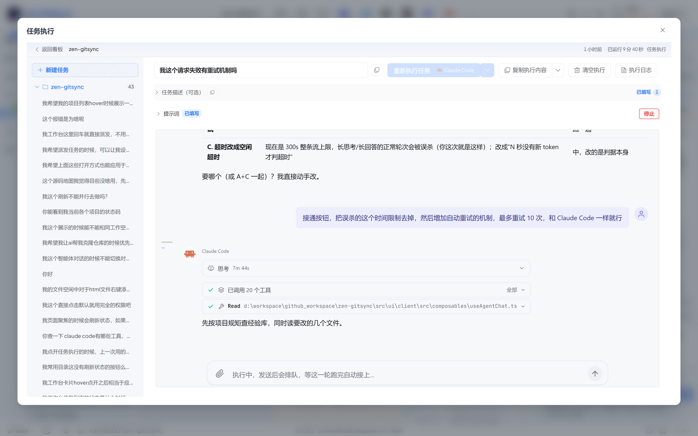

几个我觉得关键的：

**执行器可以选。** Claude Code / OpenCode / Codex 三选一，全局默认在 `设置 → 通用 → 任务执行器` 里，运行按钮旁边那个分裂按钮可以临时切换。**每个任务都是独立拉起的子进程**，跑完即散，上下文和状态不会跨任务累积 —— 这是我敢一次开五个任务的根本原因。

**跑完能接着聊。** 任务进入完成 / 出错 / 已取消之后，输入框会切到续聊模式，发出去的消息会 `--resume` 上一次的会话，新的一轮一轮叠进同一条对话流。但续聊**必须回到起这个会话的执行器** —— Claude 的 `--resume`、OpenCode 的 `--session`、Codex 的 thread id 互不通用。

**附件随便挂。** 图片 / PDF / 文本 / Markdown / CSV / JSON / log，单个到 20 MB；超过 3.5 MB 的图会先在浏览器里压一遍再传，4K 截图也传得上去。它们的绝对路径会拼进提示词，agent 自己去读。右键图片附件可以直接复制到系统剪贴板。新建任务弹窗里也能先挂 —— 那会儿任务还不存在，文件先落在服务端的暂存区，点创建时才认领过去，关掉弹窗就把它们删掉，不给你留一地截图。

**复制执行内容。** 把整条任务（每一轮，不只是屏幕上显示的这些）复制成纯 Markdown：任务和项目的头一行，然后每轮一节，含我发的提示词、它的思考、工具调用（参数和结果都在围栏里）、模型输出。默认是精简档，旁边的小箭头给全量档。它拼的是执行记录，不是从 DOM 上抠的，所以你拿到的东西跟你选没选中什么无关。

**三重完成提醒，各有各的开关。** 应用内提示（默认开）、浏览器系统通知（默认关）、提示音（默认开，完成和报错两种音，你自己按停止不响）。三个互相独立。浏览器通知权限**只在你打开那个开关的那一刻**申请，永远不会自己弹窗问你要。

### 7. 一些让人愿意长期用的细节

**别的窗口在跑什么，这边看得见。** 运行中的任务会落一份 live 记录到磁盘，所以另一个 `g ui` 窗口里跑的任务，在这块看板上照样显示，状态也不打架。反过来，别的窗口的任务你这边停不了 —— 服务端会明确告诉你"这个任务不在当前实例"，而不是甩一句"停止失败"。

**项目行悬停两个按钮：打开文件夹 / 用……打开。** 后者是个菜单：文件管理器、终端、新标签页开一个 `g ui`，以及本机装的各种编辑器和 AI 工具（VS Code、Codex、OpenCode、Kimi Code、ZCode、DeepSeek Harness、Claude Code 的普通 / 全权限两种模式）。服务端每 10 分钟探一次这 7 个 CLI，没装的条目置灰并标「未安装」，点一下给你安装引导。所有动作只作用于这一行的项目，不会动到当前看板选中的那个。

**目录真没了的项目不会消失。** 列表是"最近目录"和"任务记得的路径"的并集，所以删掉的项目仍然占一行，只是那一行给一个红色的**从列表移除**代替打开菜单（打开一个不存在的目录只能失败）。确认框会把话说清楚：**不会删任务**，缓存记录也原地保留 —— 哪天你把目录 clone 回来，这一行自己就回来了。

---

## 二、Git：那一个字母还是原来那个

工作台再热闹，日常最频繁的动作还是提交代码。这部分没变，简单过一下。

### `g`：命令行里的一个字母

```bash
$ g                              # 暂存 + 提示输入提交信息 + 提交 + 推送
$ g -y                           # 全部跳过提示
$ g -m "修复引导弹窗"             # 直接传提交信息
$ g -y --interval=1800           # 每 30 分钟自动提交推送当前目录
$ g -y --path=~/notes --interval # 后台同步某个目录
```

几个不那么常用但每用一次省一次事的：

```bash
$ g --lock-file=config.json      # 锁住文件，工具永远不会暂存它
$ g --unlock-file=config.json
$ g --list-locked
$ g --cmd="echo hello" --cmd-interval=5 --at=21:00   # 定时跑任意命令
$ g log                          # 格式化 git log
$ g get-config                   # 当前配置
```

### GUI：一屏覆盖"改了什么 → 要提交什么 → 已经提交了什么"

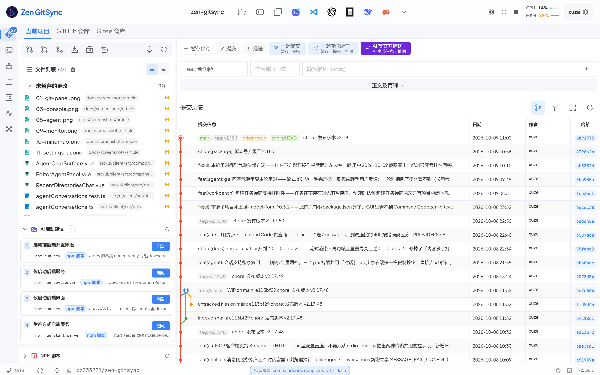

打开仓库默认就是这一屏。左边按「已声明添加 / 未暂存 / 未追踪 / 冲突」分组的变更文件，中间是结构化提交表单（`feat / fix / docs / style / refactor / test / chore` + 作用域 + 描述 + 正文 + 页脚，标准 / 自由两种模式），下面是时间倒序的提交历史。**80% 的提交动作在这一屏里就能完成。**

几个我每天都在用的：

- **选择模式 = 限定范围**：勾选几个文件后，右上角的"一键提交所选 / 一键推送所选"文案会自动切到"所选"，AI 生成提交信息也只基于勾选文件的变更。改完两个文件，勾上，AI 推断用途，直接推。
- **AI 提交并推送**：一个按钮走完"AI 读 diff 写提交信息 → 暂存 → 提交 → 推送"。
- **重置到远程**：一键 `git reset --hard origin/<branch>`，点之前自动刷新分支信息，避免重置到陈旧分支；工作区干净且没有未推送提交时按钮自动隐藏，不会被误点。
- **智能刷新**：窗口重新获得焦点、tab 重新可见、或者从活动栏切回来时，静默刷新文件状态和分支信息，不用手按 F5。
- **差异内预览**：diff 下方一键展开预览面板，`.html` / `.svg` 走沙箱 iframe（允许 JS，报告类页面的按钮能点），`.md` 走 Markdown 渲染，比例可拖，按项目保存。

### 控制台：自定义命令 + 定时提交

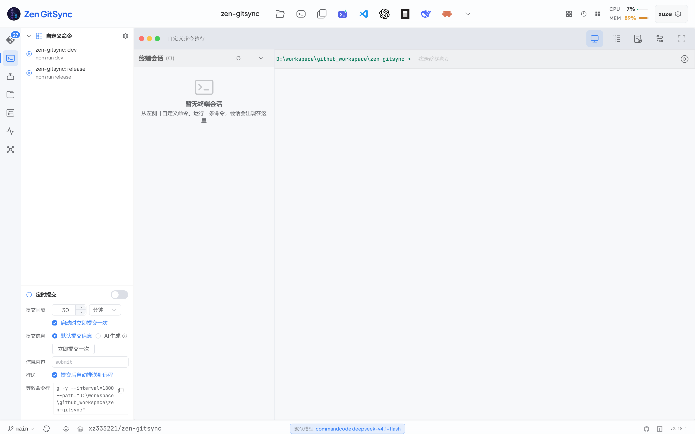

左边是保存的自定义命令（命名 + 命令 + 工作目录 + 参数），点一下就在右侧独立终端会话里跑，输出 SSE 实时回传，Windows 走 `cmd.exe`，Unix 走 `sh`，多会话可并行。

左下角的**定时提交**是把"让某个目录每隔 N 分钟自动提交推送"做成 GUI 选项：勾上开关 → 设间隔秒数 → 选分钟或"启动时立即提交一次" → 提交信息用默认或 AI 生成 → 勾"提交后自动推送"。等效命令行它也直接写在底下，复制走就能当开机脚本用。

每条命令都有独立的启用 / 停用开关，可以先把一组动作排好而不立刻跑。`ProjectStartup` 还能让打开仓库时按顺序跑命令和工作流，相当于项目启动钩子。

### 可视化编排：拖拽画布

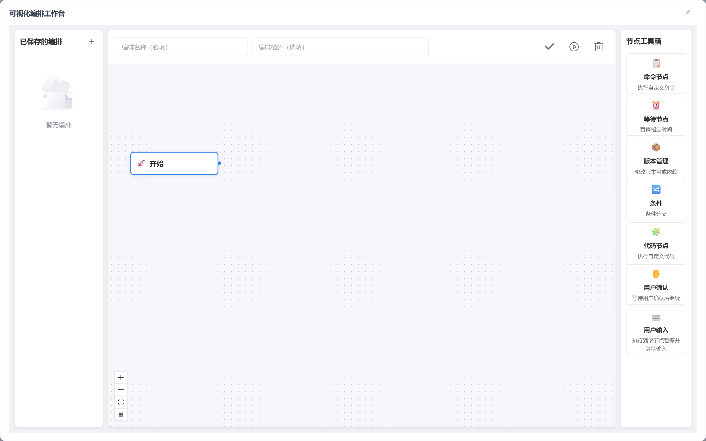

控制台工具栏那个紫色按钮点开就是拖拽画布。右侧工具箱里是命令节点、等待节点、版本节点（改 `package.json` 的 patch/minor/major 或依赖版本）、条件节点、代码节点、用户确认、用户输入。每个节点可独立启用/禁用，按拓扑顺序执行。我搭过一个"每日构建流"：更新依赖 → 等 5 分钟落盘 → 构建 → 部署 → 版本 +1，画一次之后每次点执行。

（截图里是空画布 —— 我本机确实没存编排，工具箱长什么样看得清楚。）

---

## 三、另外几个视图

**智能体**（活动栏第三个）：Web 端聊天，终端 `g ai` 和它是**同一份会话存储**（`~/.zen-gitsync/agent-sessions/`），终端建的会话在 Web 列表里带一个 `CLI` 角标。所以容器里排查问题我直接在终端 `g ai "看下 ERROR 日志"`，回到工位在 GUI 里接着追问，两端不用粘来粘去。

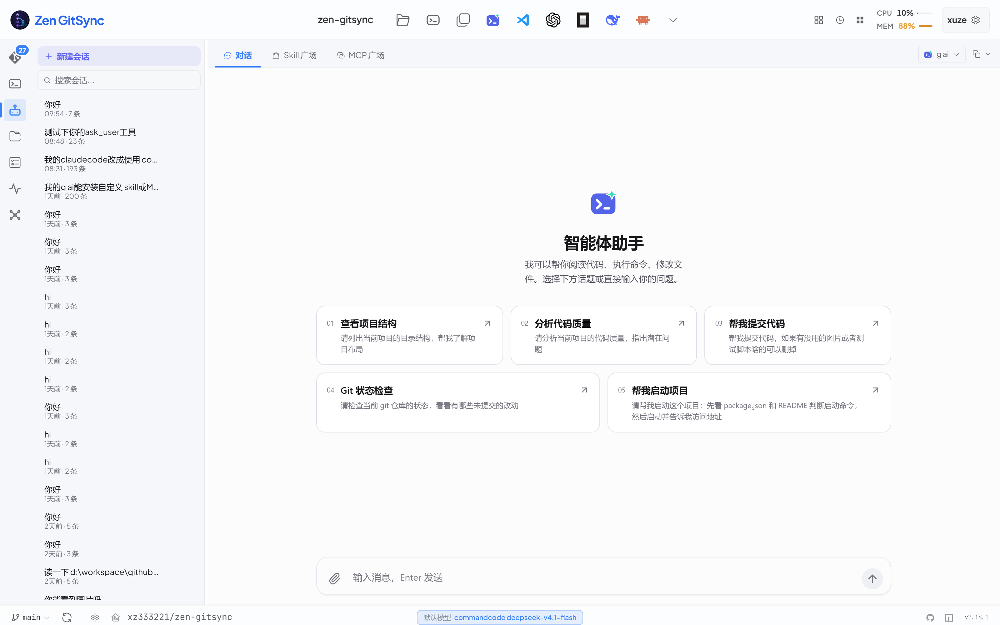

这一版它自己的新东西也不少：

- **任务计划**：多步工作先调 `update_plan` 拆成 3–8 个可验证步骤，边做边更新状态，终端里是 `✓ / ▶ / ○`，Web 里是一张折叠工具组也**不会消失**的计划卡
- **本轮用时**常显在每条回答的头部右端：流式时数字实时在跳，跑完定格成服务端记下的那个值，重开会话读回来是同一个数
- **能看图了**：`read_image` 工具 —— 你直接甩一个本地图片路径进对话，它自己读，而不是回你"我看不到内容"
- **上下文占用环**常显在输入框里，精确数字悬停才出
- **生成中也能发**：先排队，这一轮跑完自动接上；停止或报错时队列暂停
- **Skill / MCP 广场**：技能和 MCP 服务器按来源列出，装到**当前项目**或**`g ai` agent**（是 zen-gitsync 自己的目录，不是别人的）。MCP 两种形态都支持：npm 包走 stdio，远程端点走 Streamable HTTP 直连，中间不需要 `mcp-remote` 桥
- **克隆仓库优先 SSH**：让它 clone 或加远端时，会把 `https://` 先换算成 `git@github.com:owner/repo.git`，这样克隆不会卡在凭据窗口上等你输账号密码；SSH 真失败了才退回 https，并告诉你是哪一种

一轮消息最多触发的工具调用次数默认是 **1000**（`设置 → AI 模型 → Agent 运行时`，1–10000 可调），Web 和终端共用同一个值。

**文件空间**（活动栏第四个）：不离开 GUI 改文件。Monaco 语法高亮、多标签、`Ctrl+S` 保存、内联新建 / 重命名 / 删除；`.md` 一键切源码 / 渲染预览；`.html` 走沙箱 iframe，右键还能交给系统浏览器打开。文件树自动刷新，窗口重新聚焦或切回这个视图时会核对磁盘上的改动 —— 没改过就静默重载（光标和撤销历史保留），有未保存的改动会先问你，绝不自己覆盖。展开的目录和打开的标签页**按项目**记住，切回那个项目就还原。

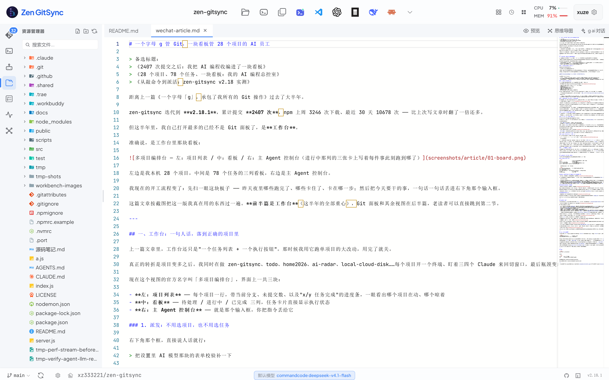

右边那个 `g ai` 对话面板是常驻的，当前打开的文件会作为上下文带进去。

**系统监控**（第六个）：CPU / 内存 / 系统运行时间 / 监听端口数四张卡，下面是按端口号排序的占用列表，点"终止"一键 kill（Windows 用 PID），搜索框按端口 / PID / 进程名过滤。手动模式下不自动轮询，避免误杀。

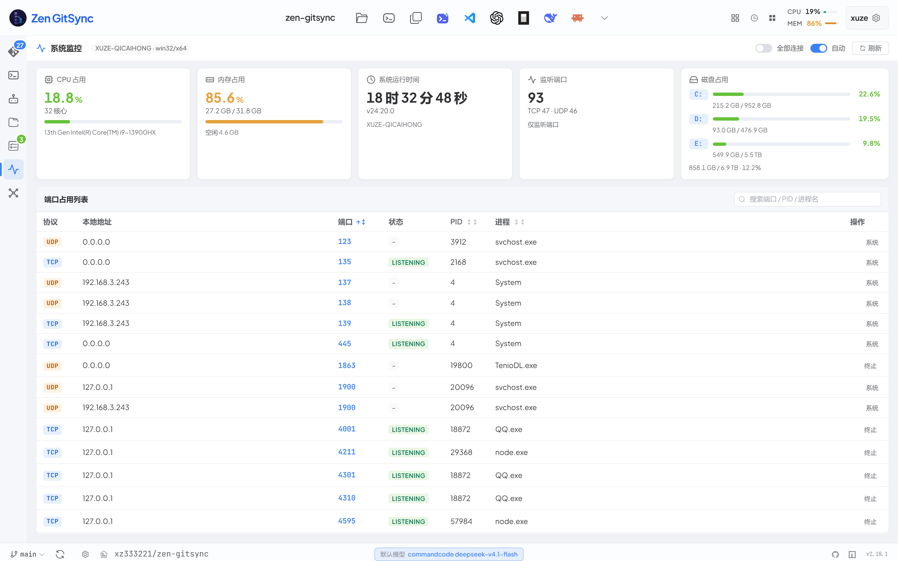

**思维导图**（第七个）：Markdown 双向导入导出，先在图上看清结构再落正文。上一篇文章里那张"认知体系"就是这个视图画的，后来它真的变成了这个项目。

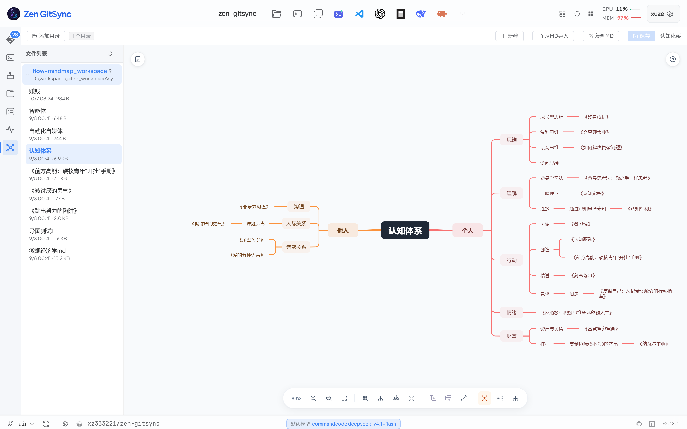

顺便说一句：上一版文章里那个"源码地图"我把入口关掉了（`SHOW_SOURCE_MAP = false`）—— 我自己一年开不到两次，留在代码里，需要的人改这个常量就行。所以活动栏现在是 7 个视图。

**设置**（右上角齿轮）：通用 / AI 模型 / Git 全局 / 提交 / 编辑配置 / 文件空间 / 记忆库 七个 tab，大部分开关即时生效，不用重启。

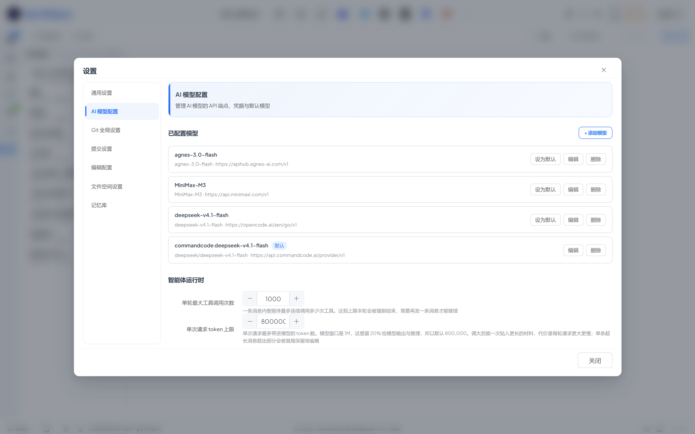

**AI 模型** tab 是核心：多套兼容 OpenAI 协议的端点并排（OpenAI、Anthropic、DeepSeek、自部署……），每套独立存 baseURL / API Key / 模型名，可以标一个默认。底栏的"默认模型"名字点一下直接跳过来。`g ui` / `g ai` / AI 生成提交信息 / 工作台调度 / 变更摘要，所有用到模型的地方都读这一份配置。

---

## 四、几个工程上的取舍

**安全：只监听回环 + Origin 白名单。** GUI 默认只绑 `127.0.0.1`，没有认证层 —— 因为一旦绑到 `0.0.0.0`，命令执行、写 `package.json`、调用系统关联程序打开文件这些接口，对同网段任何一台机器都是可调的。要跨机访问得显式放开：

```bash
$ ZEN_HOST=0.0.0.0 g ui          # macOS / Linux
$ $env:ZEN_HOST="0.0.0.0"; g ui  # PowerShell
```

收敛到回环之后，剩下的主要入口是本机浏览器里的恶意页面 —— 跨站 fetch 和 DNS rebinding 都能打到这些接口。所以所有 `/api` 请求都做 Origin 校验：`localhost` / `127.0.0.1` / `[::1]` 的任意端口放行，`file://` 页面（`Origin: null`）放行，其他来源一律 403。要额外放开的来源用 `ZEN_ALLOWED_ORIGINS` 配。

**端口不打架。** `g ui` 默认在 `[4000, 6000)` 里随机挑一个起点，撞了就顺序往下扫，多开几个实例互不干扰；想钉死用 `PORT`。

**自升级不依赖任何外壳。** 底栏版本号每个会话查一次 npm，有新版本就在旁边出现"升级"按钮，弹窗实时回传 `npm install -g zen-gitsync` 的输出，成功之后切成"立即重启并刷新"。重启是后端**自己 spawn 一个新 Node 进程**完成的 —— 没有 launcher、没有桌面壳，通过 NDJSON 把新进程的端口推回前端，旧进程再优雅退出，浏览器重定向到新端口并保留当前路径。新进程 8 秒内没就绪，旧进程就不退，弹错误，会话不断。

**无障碍做到 WCAG 2.1 AA。** 弹窗焦点陷阱与归还、`role="separator"` 且键盘可达的分隔条、纯键盘（`← → ↑ ↓`）调整面板宽度、屏幕阅读器友好的提交右键菜单、`aria-pressed` 切换按钮、提交过程中挂 `aria-busy`、Git 提交哈希在明暗两套主题下对比度都 ≥ 4.5:1。

**冷启动不等重模块。** Monaco、`@vue-flow`、`flow-mindmap`、`dagre` 全部拆成独立 chunk 按需懒加载，Git 面板首屏不等编辑器、也不等编排器。

**中英双语 + 明暗主题。** 顶栏一键切主题不用进设置，语言切换即时生效。

---

## 安装

```bash
npm install -g zen-gitsync
```

然后：

```bash
$ g ui     # 打开图形界面
$ g        # 或者就在终端里，把这次改动提交掉
```

项目地址：https://github.com/xz333221/zen-gitsync

如果觉得有点用，欢迎 Star；有任何想法或者 Issue，我都在。

---

> 说明：正文图片为**相对本文件（`docs/`）的路径**（`screenshots/article/0x-*.png`），图片实际存放在仓库的 `docs/screenshots/article/` 目录，IDE 预览与 GitHub 均可直接渲染。截图全部是 v2.18.1 实机、浅色主题、真实数据。粘贴到公众号编辑器前，请把该目录下的 PNG 上传到微信图文或你的图床，再把 Markdown 里的图片 URL 换成线上地址。
